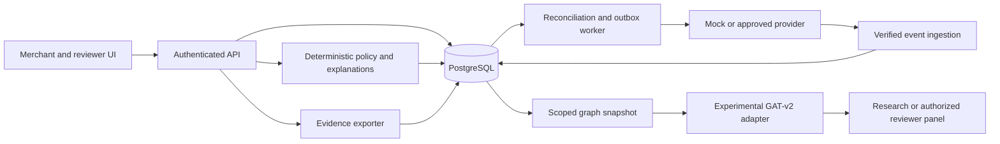
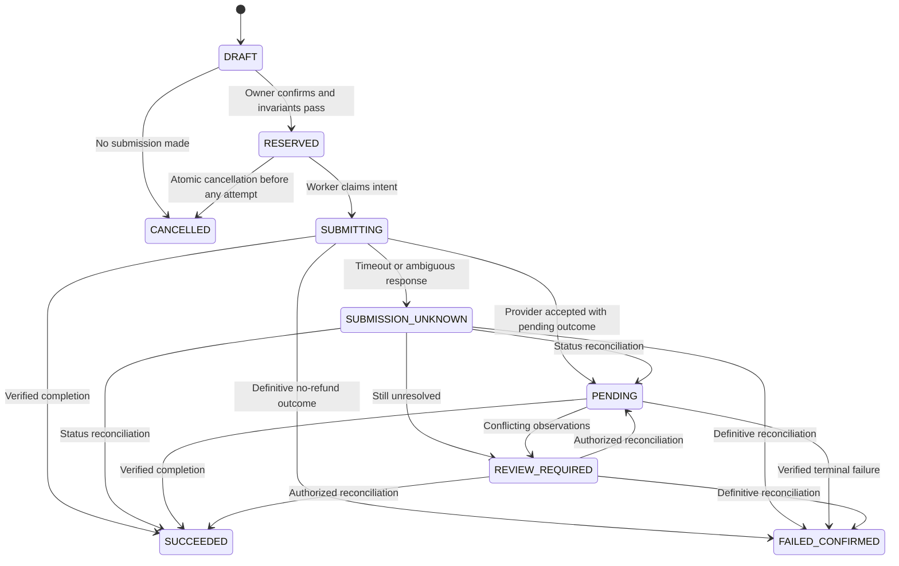

# TristackOverflow: Vyapaar Kavach

**A Paytm-oriented merchant payment exception and evidence assistant**

**Merchant promise:** Understand a disputed payment or refund request, see what is verified, and take the next supported action without accidentally paying twice.

| Document field | Value |
| --- | --- |
| Version | 1.0 — implementation proposal |
| Prepared | 2 October 2026 |
| Intended readers | Product, frontend, backend, ML, and hackathon presentation team |
| Existing asset | User-reported customized GAT-v2 fraud engine, trained on Elliptic2, reported F1 approximately 0.60 |
| Verification status | Existing code, checkpoint, data split, and reported metric have not been inspected |
| Delivery assumption | Three contributors; ten working days; a useful first slice in 48 hours |
| Default operating mode | Local demonstration with synthetic records and a mock payment provider |
| Paytm relationship | Proposed integration and positioning; no partnership, endorsement, or production access established |
| Decision | Conditional go: build the observable merchant workflow; independently test whether the graph model adds value |

This is a plan with explicit failure tests, not a guarantee of success. Demand, access to relevant data, model transfer, and differentiation still need evidence. No implementation, experiment, interview, or performance target in this document should be read as already completed unless explicitly marked as an observed fact.

## Contents

1. [Start here](#1-start-here)
2. [Problem and challenge fit](#2-problem-and-challenge-fit)
3. [Research and differentiation](#3-research-and-differentiation)
4. [Adversarial review and resulting decisions](#4-adversarial-review-and-resulting-decisions)
5. [Product scope and modes](#5-product-scope-and-modes)
6. [Merchant and reviewer workflows](#6-merchant-and-reviewer-workflows)
7. [Data availability contract](#7-data-availability-contract)
8. [Architecture and repository plan](#8-architecture-and-repository-plan)
9. [Data model and event contracts](#9-data-model-and-event-contracts)
10. [Payment and refund correctness](#10-payment-and-refund-correctness)
11. [API and provider adapter](#11-api-and-provider-adapter)
12. [GAT-v2 adaptation and research plan](#12-gat-v2-adaptation-and-research-plan)
13. [Synthetic scenarios and evaluation](#13-synthetic-scenarios-and-evaluation)
14. [Evidence and explanations](#14-evidence-and-explanations)
15. [Screens and interaction design](#15-screens-and-interaction-design)
16. [Access control and operating safeguards](#16-access-control-and-operating-safeguards)
17. [Build schedule and backlog](#17-build-schedule-and-backlog)
18. [Acceptance tests](#18-acceptance-tests)
19. [Merchant validation and business case](#19-merchant-validation-and-business-case)
20. [Demonstration and pitch](#20-demonstration-and-pitch)
21. [Release gates and fallback decisions](#21-release-gates-and-fallback-decisions)
22. [Risk register](#22-risk-register)
23. [First build session checklist](#23-first-build-session-checklist)
24. [Source register](#24-source-register)

## 1. Start here

### 1.1 The refined idea

Build an assistant for **small electronics and mobile-accessory merchants who already accept supported online or payment-link transactions and handle customer requests through calls or messaging**. This initial segment is a hypothesis to validate, not an established high-fraud segment.

The assistant starts when a merchant receives a confusing claim:

> “I paid, but your system says pending.”
>
> “My refund has not arrived; send the amount again.”
>
> “I transferred too much. Return the difference to this other account.”

It connects the claim to the merchant's actual payment and refund records, shows facts with their source and freshness, identifies unresolved discrepancies, and prepares a case summary. Authorized payment records determine payment status. Refund eligibility follows transaction and provider rules. A graph model can help a reviewer prioritize related cases only after it has earned that role through evaluation.

### 1.2 What makes the proposal distinctive

The proposed differentiator is the combination of:

1. **Claim-to-transaction matching:** Which payment is the customer referring to, and how certain is the match?
2. **A clear next action:** Refresh status, inspect an existing refund, use the supported original-source refund flow, or request missing information.
3. **An evidence timeline:** Provider observations, merchant statements, and model suggestions remain visibly separate.
4. **Conditional graph assistance:** Show relevant relationships to authorized reviewers when those relationships improve a decision or reduce investigation effort.
5. **Graceful uncertainty:** The system says what it cannot verify and continues to provide useful records.

This combination is a product hypothesis. It is not a claim to be the first product with these functions, and source-account refunds themselves are not our invention.

### 1.3 What to build first

In the first 48 hours, complete this read-only workflow:

```text
Select a payment → record the customer's claim → refresh mock provider status
→ explain the discrepancy → show the existing refund, if any
→ produce a redacted evidence summary → record the merchant's decision
```

Include a legitimate delayed refund, a repeated request against an existing refund, and an ambiguous unmatched claim. No real money should move. Refund submission, GNN inference, voice input, and a broader network view are not required to finish this first slice.

### 1.4 How the existing engine remains relevant

Preserve TristackOverflow as the graph-research engine. Audit it, expose reproducible inference, and test an adapted model on the new task. Keep a separate research view showing actual measured outputs and provenance. If graph assistance does not improve a relevant baseline, do not place it in the merchant decision path merely to preserve an AI narrative.

The defensible long-term proposition is **graph-assisted investigation with merchant-specific operational evidence**. The immediately buildable product is the payment exception workflow.

## 2. Problem and challenge fit

### 2.1 Narrow problem statement

Small merchants and their staff can struggle to reconcile a customer's payment/refund claim with transaction status, pending refunds, and incomplete supporting records. The resulting manual investigation can waste staff time, confuse legitimate customers, and create opportunities for unnecessary second payouts.

The team must validate frequency and severity. A documented fraud mechanism or account-freeze case does not prove that this is a frequent, commercially meaningful problem for the chosen segment.

### 2.2 Jobs to be done

| User | Job | Successful outcome |
| --- | --- | --- |
| Merchant owner | Resolve a confusing request while running the shop | A correct next step with minimal interruption |
| Counter staff | Check facts without financial authority | Verified status and an owner escalation when needed |
| Legitimate customer | Understand what happened and what to expect | A clear, accurate explanation without an accusation |
| Authorized reviewer | Investigate an exception with available evidence | A complete timeline and traceable supporting records |
| ML researcher | Test whether relationships add information | Reproducible improvement over a strong baseline, or a documented negative result |

### 2.3 How it answers the brief

| Challenge requirement | Proposed response | Evidence to collect |
| --- | --- | --- |
| Real small-merchant problem | Confusing payment/refund claims and evidence preparation | Interviews and observed workflows |
| Efficiency | Reduce active handling time and duplicate investigation | Counterbalanced task study |
| Financial outcome | Reduce incorrect extra-payout decisions in relevant cases | Scenario decisions first; real outcomes only in an authorized pilot |
| Meaningful innovation | Combine verified transaction state, evidence provenance, and evaluated relationship context | Baseline comparison and graph ablation |
| Measurable value | Faster correct decisions without more harmful errors | Error counts, handling time, escalation burden |
| Paytm relevance | Use supported merchant payment/refund capabilities; propose reviewer assistance alongside existing risk systems | Integration capability check and partner feedback |

The weakest part of the challenge fit is “beyond existing financial solutions.” A refund dashboard alone is too incremental. The project needs demonstrated workflow improvement and, for a strong GNN-centered pitch, demonstrated incremental investigation value. If those tests fail, do not compensate with more features or a more dramatic name.

### 2.4 Non-goals

- Declaring a merchant or customer innocent, guilty, trustworthy, or fraudulent.
- Preventing, reversing, or bypassing bank, payment-provider, or law-enforcement restrictions.
- Tracing all UPI money flows or treating Paytm as having universal bank visibility.
- Asking customers to disclose a UPI PIN, OTP, or banking password.
- Moving money to a customer-specified alternative account.
- Autonomous refunds, holds, blacklists, lending decisions, or public reputation scores.
- A new inventory, lending, bookkeeping, or generic merchant chatbot product.

## 3. Research and differentiation

### 3.1 Observed facts and their limits

| Finding | Source | Implication |
| --- | --- | --- |
| Paytm Pi advertises transaction fraud prevention, anomaly detection, reduced false declines, and case management | [Paytm Pi](https://business.paytm.com/paytm-pi) | Generic fraud scoring is not sufficient differentiation; public pages do not reveal the whole internal roadmap |
| Paytm describes wrong-transfer requests and requests to return money to another account | [Paytm UPI fraud guidance](https://paytm.com/blog/payments/upi/upi-frauds/) | Relevant scenario to investigate; not evidence of prevalence in our chosen segment |
| Paytm documents payment and refund status notifications | [Callback and webhook documentation](https://business.paytm.com/docs/callback-and-webhook/) | A provider adapter is plausible for eligible integrations; access must be checked |
| Refunds are tied to original transactions and return through the original source flow | [Refund overview](https://business.paytm.com/docs/refund-management/) | Build guidance and evidence around this existing capability |
| A reported AP High Court case concerned a trader's account frozen following a Rs 1,000 UPI payment | [LiveLaw case report, July 2026](https://www.livelaw.in/high-court/andhra-pradesh-high-court/andhra-pradesh-high-court-vendors-verify-upi-customer-antecedents-540137) | Merchant spillover is a useful background motivation; do not market this prototype as an account-unfreezing service |
| Elliptic2 is a Bitcoin-cluster subgraph AML dataset | [Elliptic2 paper](https://arxiv.org/abs/2404.19109) | Existing results cannot establish merchant UPI detection performance |

Research used web search, official documentation, and research papers. Firecrawl was discovered but disabled by the administrator in this environment; it was not used. No merchant interviews or Paytm discussions have been conducted for this document.

### 3.2 Competitive boundary

| Existing capability | What we must not call novel | Hypothesis worth testing |
| --- | --- | --- |
| Paytm Pi | Fraud scoring or case management in general | Merchant-specific claim handling and evidence that reduce support effort |
| Paytm payment/refund dashboard | Original-source refunds or viewing status | Fewer steps to resolve a claim across payment, refund, and merchant records |
| Simple checklist | “Verify payment before refunding” | Reliable matching, reconciliation, and traceability under messy cases |
| Database joins | Finding repeated references to one transaction | GNN value beyond direct links and simple graph features |

Interview participants using the actual available Paytm workflow when possible. If it already solves the proposed job quickly, narrow the project to an unresolved step or stop the standalone product claim.

### 3.3 Decision among alternative ideas

| Direction | Reuse of graph research | Main dependency | Decision |
| --- | --- | --- | --- |
| Merchant payment exception and evidence assistant | Moderate now; stronger with authorized relationship data | Merchant workflow validation | Build the narrow prototype |
| Supplier identity/scam network | Potentially strong | Reliable supplier identities, outcomes, and shared data rights | Defer |
| Festival surge / false-positive review | Potentially strong | Historical merchant data and independently adjudicated outcomes | Defer to a partner-backed study |
| Generic AI merchant assistant | Weak connection to current engine | Broad product work in a crowded category | Reject for this project |

## 4. Adversarial review and resulting decisions

Five independent advisory perspectives were used, followed by five reviews of anonymized responses. All were AI reviews using different reasoning lenses, not interviews with merchants, payment engineers, or legal experts. Concurrency limits required independent batches. Their agreement is a design signal, not market evidence.

### 4.1 First challenge: are we solving the right problem?

**Objection:** “You started with a GNN and searched for a merchant problem.”

**Response:** Start with the observable merchant decision and compare against today's workflow. Preserve the graph engine as a falsifiable hypothesis. The product cannot depend on inaccessible upstream banking records.

**Change made:** Narrowed the product from broad fraud-spillover protection to payment/refund exception handling and evidence preparation.

### 4.2 Second challenge: is the GNN necessary?

**Objection:** “Checking a payment and spotting a duplicate refund are rules or SQL queries.”

**Response:** Correct. Those tasks remain deterministic. Test GNN-assisted prioritization separately against rules, tabular features, and simple graph statistics. A compelling graph picture is not evidence that a GNN improves decisions.

**Change made:** Added a model gate, graph ablations, and a research-only fallback. Alternate-account requests are not used as proof of GNN value because a simple rule already detects that request type.

### 4.3 Third challenge: is the data real and observable?

**Objection:** “The demo assumes a full payment network that the team cannot access.”

**Response:** Maintain separate merchant-local and partner-research graphs. Every feature has a source, permission boundary, observation time, and missing-data behavior. Synthetic networks carry persistent labels.

**Change made:** No cross-merchant correlation in the ordinary merchant mode. Partner access must be established before any such experiment on real data.

### 4.4 Fourth challenge: could the product itself cause loss?

**Objection:** “A timeout or duplicate click could create a second refund.”

**Response:** First release is read-only. Mock refund execution follows a state machine with local idempotency, reservations, and status reconciliation. Live execution is a separate later gate.

**Change made:** Financial-state correctness precedes graph polish. An ambiguous refund outcome retains its reservation and never triggers a blind resubmission.

### 4.5 Fifth challenge: does the evaluation prove anything?

**Objection:** “Curated synthetic scams, unequal information, and repeated tasks make the prototype look artificially good.”

**Response:** Freeze an independent scenario set, give conditions equal underlying information, counterbalance task order, and separate active handling time from provider waiting time. Report all errors and participant counts.

**Change made:** Added a three-condition workflow study, held-out graph mechanisms, and explicit limits on simulated results.

### 4.6 Where the reviews agreed, disagreed, and found gaps

**Agreement:** Build a narrow evidence-backed workflow; do not transfer the Bitcoin F1 claim; treat missing data as unknown; require a baseline; preserve legitimate refunds.

**Disagreement:** Whether to implement refund execution early. Resolution: read-only first, mock execution after correctness tests, live execution outside the ten-day default scope.

**Blind spots caught:** Order matching without a reference; cross-merchant authorization; outside-dashboard refunds; provider freshness; checklist competition; adoption cost; graph-demo confounding; evidence authenticity versus integrity.

**Recommendation:** Proceed with the limited prototype and parallel graph experiment. Do not pitch validated fraud prevention until relevant real-world evaluation exists.

**First action:** Write and agree on three complete case fixtures, including their evidence, timestamps, expected action, and unavailable facts. Implement them end to end before adding a model.

## 5. Product scope and modes

### 5.1 Explicit operating modes

| Mode | Data | Available behavior | Banner |
| --- | --- | --- | --- |
| `DEMO_LOCAL` | Synthetic merchant-local records | Read-only workflow and optional mock refunds | Synthetic data · Mock provider |
| `RESEARCH_NETWORK` | Synthetic or separately approved research graph | Experimental reviewer analysis; no money movement | Research mode · source and model version shown |
| `SANDBOX_READ_ONLY` | Provider staging data after access verification | Status verification and evidence; no production writes | Paytm staging · No real funds |
| `PILOT_READ_ONLY` | Authorized merchant records | Verification, timeline, export, manual handoff | Pilot · Advisory only |
| `LIVE_EXECUTION` | Approved production integration | Explicitly authorized original-transaction refunds | Not part of the default build; separate release gate |

Never mix environments in a tenant, case, database export, or performance report. Use distinct provider credentials, namespaces, and datasets. Demo transactions must never reach a live adapter.

### 5.2 Feature priorities

| Priority | Feature | Completion evidence |
| --- | --- | --- |
| P0 | Merchant-scoped payment lookup and ambiguous-match handling | Correct behavior for exact, missing, and duplicate candidates |
| P0 | Persisted event timeline and mock status refresh | Events trace to the resulting state |
| P0 | Separate payment/refund state and freshness | Pending/unknown states displayed accurately |
| P0 | Deterministic next-step explanations | Each recommendation points to observable facts |
| P0 | Redacted Markdown/JSON evidence export | Correct tenant, case, sources, timestamps, limitations |
| P0 | Roles and server-side ownership checks | Cross-tenant access tests pass |
| P1 | Mock refund reservation and reconciliation | Timeout, concurrency, and partial-refund tests pass |
| P1 | Reviewer relationship view | Known edges distinguish facts, assertions, and synthetic links |
| P1 | Reproducible existing-model audit and adapter | Model manifest, schema, actual inference or explicit unavailable state |
| P1 | Baseline and adapted GNN evaluation | Saved splits, seeds, predictions, and comparisons |
| P2 | Provider staging adapter | Verified credentials and capability tests |
| P2 | Hindi templates and merchant usability refinement | Human-reviewed wording and comprehension checks |
| Later | Real partner graph, PDF export, additional languages | Separate scope after earlier gates |

No always-listening audio, Soundbox firmware changes, automatic messages, LLM agents with financial tools, Kafka, or dedicated graph database in the MVP.

## 6. Merchant and reviewer workflows

### 6.1 Workflow A: verify a payment claim

1. Merchant signs in; the server establishes tenant and role.
2. Merchant selects an order/payment or enters its exact reference.
3. If no exact reference exists, request amount, approximate time, and an order identifier. Search only that merchant's records.
4. Present candidates; never bind by amount alone. Merchant confirms the match or leaves the case unmatched.
5. Record the claim as a merchant statement, not a provider fact.
6. Refresh supported payment/refund status; validate provider responses and persist observations.
7. Show confirmed payment status, last check time, existing refunds, and missing evidence.
8. Generate the next step from a versioned rule set.
9. Merchant records their action or exports the summary. The app does not certify fulfillment or guarantee that funds cannot later be disputed.

### 6.2 Workflow B: customer says a refund has not arrived

1. Match the original payment and list known refunds, including refunds initiated outside this app when available.
2. Refresh the relevant refund status.
3. If pending or outcome unknown, explain that the existing refund is unresolved. Do not recommend a second payout.
4. If the provider reports refund success, show the precise reported status, reference, and observation time. Do not overstate bank credit completion beyond the provider's documented semantics.
5. If status cannot be confirmed, offer a case summary and manual provider-support handoff.
6. Do not promise a refund arrival deadline unless the source supplies an applicable date; describe any such date as provider-reported.

### 6.3 Workflow C: request to refund to a different account

1. Record the requested action; do not collect a new account identifier unless needed for authorized research or investigation.
2. Verify the original payment and existing refunds.
3. Explain that supported refunds follow the original transaction's source route. A different destination request is a workflow discrepancy, not proof of fraud.
4. Offer the existing supported refund process if eligible and authorized, or manual support if eligibility is unknown.
5. Record the resolution without sending a new transfer.

The system need not know a payer's bank account or VPA to enforce this: its refund API contract simply has no arbitrary destination field.

### 6.4 Workflow D: evidence review

1. An authorized reviewer opens a case within their assigned scope.
2. Timeline labels each entry: verified provider observation, merchant assertion, system calculation, or experimental inference.
3. Reviewer inspects source references and identifies missing records.
4. A local relationship view links orders, payments, refund requests, and events. Database traversal is sufficient for these direct relationships.
5. If approved research data and a qualified model are available, a separate panel shows advisory review priority and relevant supporting context.
6. Reviewer records a reasoned disposition. That disposition is not automatically a fraud-training label.
7. Merchant receives only the applicable next step and their own case records.

### 6.5 Workflow E: unknown outcome after mock refund submission

1. Owner confirms amount and original payment.
2. Server atomically creates the refund intent, reserves the amount, and writes an outbox job.
3. Worker records an attempt before making the provider request.
4. Timeout occurs; state becomes `SUBMISSION_UNKNOWN` and reservation remains active.
5. Reconciler queries the same refund reference; it does not create a new one.
6. A verified outcome moves the intent to pending, succeeded, or definitively failed.
7. Unknown/unmapped/conflicting outcomes remain under review. The UI never converts uncertainty into permission for a replacement payment.

### 6.6 Missing data is a first-class outcome

| Situation | Behavior |
| --- | --- |
| No exact payment match | Ask for a reference or keep the case unmatched |
| Provider unavailable | Show last verified observation and stale status; allow read-only export |
| No payer identifier | Do not invent a customer node or link identities by name |
| No model or incompatible checkpoint | Hide score; retain deterministic assistance |
| No network visibility | Show local records only; do not imply clean upstream funds |
| Invoice unavailable | Mark evidence missing; do not treat absence as fraud |
| Contradictory verified events | Reconcile and require review, preserving both observations |

## 7. Data availability contract

### 7.1 Allowed data sources

| Signal | Proposed source | Availability | Missing-data behavior |
| --- | --- | --- | --- |
| Merchant identity and role | App authentication plus merchant integration mapping | Required | Deny access without mapping |
| Order reference | Merchant's order records | Required for unambiguous link | Keep unmatched if not established |
| Payment ID, amount, status | Eligible provider status API/verified event | Conditional on integration | `UNKNOWN`; do not infer from screenshots |
| Refund reference, amount, status | Eligible provider API/event/report | Conditional | Refresh or manual handoff |
| Remaining refund eligibility | Reconciled records plus provider capability checks | Not guaranteed by a local ledger | Advisory only until complete |
| Customer's stated request | Merchant-entered case form | Usually available | Preserve as assertion |
| Invoice or fulfillment record | Merchant upload or order system | Optional | Missing is not evidence of fraud |
| Stable customer/account identifier | Explicit, documented, authorized source | Not guaranteed | No entity linkage |
| Other merchants' cases | Approved partner workspace | Unavailable in ordinary mode | Exclude |
| Upstream/downstream bank transfers | Approved partner data if actually available | Unavailable by default | Exclude; never fabricate |
| Complaint or confirmed investigation outcome | Authorized adjudication source | Unavailable by default | Unlabeled, not negative |
| Device/IP/KYC relationships | Specifically authorized partner fields | Outside MVP | Exclude |

The public transaction-status documentation describes a merchant-specific order lookup. That is not permission or capability to inspect unrelated accounts. [Transaction Status API](https://business.paytm.com/docs/api/v3/transaction-status-api/)

### 7.2 Required provenance per field or relationship

```text
source_kind: provider | merchant_statement | system_derived | synthetic | model
source_record_id
tenant_id
provider_environment
event_time
observed_at
ingested_at
verification_status
permission_scope
derivation_version, when applicable
```

For decisions at time T, use only information whose `observed_at <= T`; an earlier transaction that was discovered later was not knowable at T. Preserve event time separately to reconstruct sequences.

### 7.3 Graph boundaries

**Merchant-local graph:** Orders, payments, refund intents, requests, and evidence belonging to one tenant. Useful for traceability; a GNN is not automatically justified.

**Partner research graph:** Only specifically approved account/merchant/payment relationships with explicit coverage metadata. Even a Paytm partnership does not imply a complete UPI or banking network.

**Synthetic graph:** A generated experimental world, clearly distinguished from observed merchant data. Visibility masks emulate what each deployment mode could actually observe. Evaluate both full synthetic visibility and restricted visibility; the latter is the deployability-relevant condition.

## 8. Architecture and repository plan

### 8.1 Recommended implementation

Use a small Python-centered backend to reduce friction with the existing GNN stack. This is a proposed stack; preserve compatible existing project choices after the repository is recovered.

| Layer | Proposed choice | Reason |
| --- | --- | --- |
| Merchant/reviewer UI | React + TypeScript + Vite | Focused client with no second backend |
| API | FastAPI + Pydantic | Clear typed contracts; close to Python ML code |
| Data | PostgreSQL + SQLAlchemy + Alembic | Transactions, locks, migrations, audit records |
| Background tasks | PostgreSQL job/outbox table + Python worker | Avoid an extra queue service for the prototype |
| Graph construction | Python + existing PyTorch Geometric utilities | Reuse compatible engine components |
| Inference | Versioned adapter, initially CPU or recorded research artifact | No GPU required for the workflow demo |
| Reviewer visualization | Cytoscape.js or a small existing graph component | Directed edges with source labels |
| Attachments | Local private storage for synthetic demo; private object storage later | Keep financial records outside public paths |
| Verification | pytest + API integration tests + browser workflow checks | Prioritize correctness and meaningful user journeys |

Pin versions after testing compatibility. Do not replace the project's working PyTorch/PyG environment merely to use newer versions. An LLM is unnecessary for P0: use structured forms and deterministic explanation templates.

### 8.2 System diagram



There is no edge from the GNN directly to a refund submission, account hold, or customer message. The API applies role checks and financial invariants independently of any model result.

### 8.3 Proposed repository layout

```text
tristackoverflow/
  apps/web/src/
    pages/{payments,cases,review,research}/
    components/{status,timeline,evidence,graph}/
  services/api/app/
    auth/
    payments/
    refunds/
    cases/
    providers/{base,mock,paytm}/
    evidence/
    policies/
    workers/
    models/
  services/api/tests/
    unit/
    integration/
    adversarial/
  research/
    existing_engine/          # reference/import; preserve original code
    adapters/
    graph_builder/
    baselines/
    evaluation/
    manifests/
  fixtures/
    merchant_cases/
    provider_events/
    research_scenarios/
  scripts/
  docs/
  .env.example
```

These are proposed paths and modules, not files that currently exist. Keep model training separate from API startup. Cache inference by graph snapshot hash plus model version; invalidate when either changes. Start with one app, one database, and one worker.

## 9. Data model and event contracts

### 9.1 Minimum tables

All tenant-owned tables carry `tenant_id` and `environment`. Use composite foreign keys or equivalent server-enforced checks so a case cannot reference another tenant's payment.

| Table | Minimum fields beyond internal ID | Important constraint |
| --- | --- | --- |
| `tenants` | display name, provider account mapping, environment, capability profile | A provider account cannot silently change tenant |
| `memberships` | user ID, tenant ID, role, active flag | Role obtained server-side |
| `orders` | merchant order reference, amount paise, currency, created time | Unique tenant/environment/order reference |
| `payments` | order ID, provider transaction ID, confirmed amount, observed status, last verified time, projection version | Preserve multiple payment attempts separately |
| `provider_events` | event fingerprint, raw record pointer, signature result, event time, observation time, processing status | Logical deduplication without destroying meaningful status changes |
| `cases` | payment ID nullable, claim type, requested amount, match status, case status, creator, resolution | Unmatched cases cannot initiate refunds |
| `case_notes` | author, statement, source type, timestamp | Append changes with authorship |
| `refund_intents` | payment ID, amount, stable ref ID, idempotency key, request hash, state, authorized actor | Unique tenant/environment/ref ID; unique scoped idempotency key |
| `refund_attempts` | intent ID, attempt time, request hash, provider response pointer, transport outcome | No loss of ambiguous attempts |
| `provider_refunds` | original payment, provider refund ID/ref ID, amount, latest observation, origin | Reconcile external-dashboard refunds without double-counting local intents |
| `attachments` | case ID, private storage key, MIME, size, digest, uploader, source type | No public bucket path |
| `observations` | subject, source record, verified fields, observed time, valid time | Facts trace back to source |
| `audit_entries` | actor, action, object, before/after reference, timestamp, request ID | Append-only at application level |
| `outbox_jobs` | job type, aggregate ID, lease, attempts, next run time, status | Recoverable worker ownership |
| `graph_snapshots` | scope, cutoff, graph/feature versions, source manifest, coverage, digest | Immutable model input artifact |
| `model_runs` | snapshot, model version, output, abstention reason, runtime | Does not mutate financial state |

Store money as integer paise, never floating point. Store canonical timestamps in UTC and display the merchant's timezone explicitly. Preserve original provider amounts/timestamps in raw observations for audit. Database constraints reject negative amounts and mismatched currencies.

### 9.2 Example normalized provider observation

This is an internal schema, not a Paytm payload. Example IDs and amounts are synthetic.

```json
{
  "schema_version": "provider-observation.v1",
  "tenant_id": "merchant_demo_01",
  "environment": "DEMO_LOCAL",
  "source_kind": "synthetic",
  "provider": "mock",
  "provider_account_id": "mock_mid_01",
  "subject_type": "payment",
  "provider_transaction_id": "mock_txn_017",
  "merchant_order_id": "order_017",
  "amount_paise": 300000,
  "currency": "INR",
  "normalized_status": "SUCCEEDED",
  "raw_status": "MOCK_SUCCESS",
  "raw_result_code": "MOCK_01",
  "event_time": "2026-10-02T10:00:00Z",
  "observed_at": "2026-10-02T10:00:02Z",
  "verification_status": "MOCK_VERIFIED",
  "source_record_id": "event_mock_017"
}
```

An import from a merchant spreadsheet or screenshot must use its actual source classification; it cannot become a verified provider observation merely because it looks like this schema.

### 9.3 Example recommendation contract

```json
{
  "case_id": "case_demo_03",
  "policy_version": "exceptions.v1",
  "action": "CHECK_EXISTING_REFUND",
  "reason_codes": ["REFUND_OUTCOME_UNKNOWN"],
  "summary": "An existing refund has an unconfirmed outcome. Check its status before taking another action.",
  "supporting_observation_ids": ["observation_demo_48"],
  "missing_facts": ["current_refund_outcome"],
  "provider_last_checked_at": "2026-10-02T10:05:00Z",
  "model_used_for_action": false,
  "execution_allowed": false
}
```

Do not return an invented numeric fraud probability when no calibrated, applicable model exists. Confidence in a payment observation, match confidence, and model uncertainty are different concepts and require separate fields.

## 10. Payment and refund correctness

### 10.1 Payment state

Use separate dimensions:

- `payment_status`: `UNKNOWN`, `PENDING`, `SUCCEEDED`, `FAILED`, `NO_RECORD`.
- `verification_state`: `UNVERIFIED`, `VERIFIED`, `STALE`, `CONFLICTED`.
- `settlement_status`: optional and independent; absence means unknown.
- `dispute_status`: optional and independent; a payment success does not imply no dispute.

Do not regress a confirmed success because a delayed pending event arrived. Do not use arrival order alone as event authority. Preserve observations; on contradictory verified results, reconcile with the appropriate status API and record a conflict until resolved.

`NO_RECORD` can indicate a bad reference, wrong environment, delayed availability, or missing coverage. It is not proof that the customer lied. Similarly, payment success does not certify receipt of goods, legal entitlement to a refund, or final immunity from disputes.

### 10.2 Refund state machine



`REVIEW_REQUIRED` retains the financial reservation until a definitive outcome is established. It is not an arbitrary override switch. Post-submission cancellation is not offered by our application. Confirm provider-specific lifecycle behavior before enabling any live action.

### 10.3 Financial invariants

For each payment, calculate from reconciled records:

```text
local_candidate_refundable = max(
    0,
    verified_success_amount
    - successful_refunds
    - unique_reserved_pending_or_unknown_refund_amounts
    - confirmed_dispute_or_other_nonrefundable_adjustments
)
```

Important implementation details:

1. Successful amounts and active reservations are mutually exclusive for the same refund. Moving to success removes the reservation and records the completed refund atomically. Pending/unknown exposure is the deduplicated union of local reserved intents and observed external pending/unknown refunds, not just intents created in this app.
2. A provider refund corresponding to a local intent is one refund, not two amounts.
3. External-dashboard refunds must be imported or reconciled before enabling a new live refund. Unknown external activity or an unresolved external refund whose amount is unavailable means local eligibility is only advisory and execution stays disabled.
4. If the provider exposes a validated remaining-refundable amount, use the more restrictive applicable amount. If it does not, a locally positive balance alone does not prove eligibility.
5. Dispute adjustments must be confirmed and deduplicated against refunds; no guessed deduction.
6. Provider restrictions, refund window, merchant configuration, and supported partial-refund behavior can reduce eligibility further.
7. Currency must match; a positive amount must be no greater than the applicable eligible amount.

The invariant is enforced inside a database transaction with a lock on the payment aggregate. Two staff members cannot each reserve the same remaining balance.

Our database lock cannot serialize actions made independently in a provider dashboard or another integration. Recheck provider state before submission and rely on documented provider-side eligibility controls for cross-channel races. If those controls or refund-history coverage cannot be established, keep our app read-only. Local idempotency is not a claim of globally exactly-once money movement.

Example: a Rs 1,000 payment with an observed Rs 600 external pending refund has at most Rs 400 locally available before other restrictions. If verified external records violate expected limits or cannot be reconciled, preserve those facts, mark a financial-state conflict, and disable new submissions; do not discard observations to make the invariant appear to pass.

### 10.4 Safe submission pattern

The following pseudocode describes a planned adapter, not a working integration:

```text
authorize owner and tenant
require correct provider environment and capability
require unambiguous payment link and fresh reconciled status
check local idempotency key:
    same key + same payload -> return existing intent
    same key + changed payload -> reject conflict
lock payment row
recompute eligibility from current observations and reservations
create intent with stable provider reference
reserve amount and write outbox job in same DB transaction
commit

worker claims job with lease
records submission attempt before network call
submits once using the persisted reference
persists response or ambiguous transport outcome
reconciles by that reference when needed
```

A worker crash after recording an attempt must be treated as a possibly submitted request. Do not assume “no response stored” means “no money moved.” Do not retry with a new reference until the original outcome is definitively resolved and any new attempt meets documented provider rules.

Outbox delivery is at least once. Use a compare-and-set state transition or row lock to claim the initial submission, and record its attempt durably. An expired worker lease does not authorize another submission: any intent with a recorded unresolved attempt is routed to reconciliation. A replacement worker cannot reset it to `RESERVED` merely to make progress.

### 10.5 Provider mapping trap to implement explicitly

The Refund API documentation includes duplicate-reference rejection and result codes whose descriptive meaning matters. For example, code `628` is listed with `TXN_FAILURE` while its message describes a bank-side pending refund. Code `626` concerns another refund in progress. A top-level failure string is therefore insufficient to release a reservation. Maintain an endpoint-specific, versioned mapping and query refund status for ambiguous outcomes. [Refund API](https://business.paytm.com/docs/api/refund-api/)

The refund status endpoint is queried using the original merchant/order/refund reference. Validate response authenticity and interpret the documented result code and phase together; preserve unknown codes for investigation. [Refund Status API](https://business.paytm.com/docs/api/refund-status-api/)

### 10.6 Event processing

- Validate signature/checksum according to the exact enabled endpoint's documentation; do not invent a generic signature algorithm. [Checksum documentation](https://business.paytm.com/docs/checksum/)
- Resolve the merchant from a trusted server-side configuration and verify the payload's mapping.
- Validate size and schema before persisting; keep invalid events in a restricted quarantine log with minimal metadata.
- Persist accepted events before acknowledging success. If persistence fails, return the appropriate retriable error.
- Use a documented event identifier when available. Otherwise define a canonical fingerprint that includes subject, status, amount, and relevant event/version information. Do not deduplicate every event sharing a transaction ID.
- A duplicate delivery must have no duplicate financial side effect. A later status change for the same transaction must remain processable.
- Rebuild projections from preserved observations; log the policy/mapping version used.
- Reconciliation jobs use bounded retries with backoff and jitter. Unresolved cases remain visible; exhaustion does not imply failure.

### 10.7 Read-only fallback

If complete refund reconciliation cannot be guaranteed, disable in-app execution and direct the merchant to the provider's supported workflow with the original transaction reference. Record that a handoff occurred, not that a refund occurred. Only a later verified observation can establish its outcome.

## 11. API and provider adapter

### 11.1 Proposed internal endpoints

These endpoints belong to our app. They are not Paytm API routes.

| Method and path | Role | Behavior |
| --- | --- | --- |
| `GET /v1/payments` | Staff/owner | Tenant-scoped search and pagination |
| `GET /v1/payments/{id}` | Staff/owner | Payment, refunds, freshness, and evidence pointers |
| `POST /v1/payments/{id}/refresh` | Staff/owner | Queue or perform rate-limited status reconciliation |
| `POST /v1/cases` | Staff/owner | Create a claim, including unmatched claims |
| `POST /v1/cases/{id}/match` | Staff/owner | Record an explicit payment match and supporting references |
| `GET /v1/cases/{id}/recommendation` | Staff/owner | Deterministic explanation and missing facts |
| `POST /v1/cases/{id}/notes` | Staff/owner | Append a merchant statement |
| `POST /v1/cases/{id}/attachments` | Staff/owner | Private validated upload |
| `GET /v1/cases/{id}/export` | Owner/authorized reviewer | Redacted evidence export with audit entry |
| `POST /v1/cases/{id}/resolve` | Owner/reviewer | Record disposition; no implied fraud label |
| `POST /v1/refund-intents` | Owner | Disabled in read-only mode; mock execution after gates |
| `GET /v1/refund-intents/{id}` | Staff/owner | State, reservation, reference, and verification time |
| `POST /v1/provider-events/{provider}` | Verified provider channel | Endpoint-specific validation and durable ingestion |
| `GET /v1/review/cases/{id}/graph` | Scoped reviewer | Only relationships authorized for that reviewer |
| `POST /v1/research/runs` | Research role | Synthetic/approved research run; no financial authority |

Object IDs are never sufficient authorization. Use authenticated membership and database scope on every lookup, export, attachment, graph, and cache access. An inaccessible object should not leak whether it exists.

### 11.2 Provider interface

```python
class PaymentProvider:
    def capabilities(self, merchant_context): ...
    def verify_and_parse_event(self, raw_body, headers, merchant_config): ...
    def get_payment_status(self, merchant_context, order_reference): ...
    def get_refund_status(self, merchant_context, order_reference, refund_reference): ...
    def list_or_reconcile_refunds(self, merchant_context, payment_reference): ...
    def submit_original_source_refund(self, merchant_context, immutable_intent): ...
```

If listing/reconciliation is unsupported for an account, the method returns `UNSUPPORTED`, not an empty history. Capability absence disables dependent execution. `submit_original_source_refund` accepts no free-form destination. All adapters use request timeouts and structured transport outcomes.

### 11.3 Capability profile

```text
payment_status_read
refund_status_read
refund_history_complete
verified_webhooks
refund_submit
partial_refund
dispute_visibility
approved_research_identity_fields
```

A capability is true only after documentation review and account-specific testing. Do not infer that every offline static QR merchant has the same APIs as a Payment Gateway integration.

Define freshness limits in the capability profile. For a mock demonstration, a 60-second maximum observation age is a configurable test setting. Before any live execution, use a provider-specific approved limit and refresh immediately before eligibility checks. An unset freshness limit disables execution. A fresh observation still cannot eliminate concurrent external changes.

### 11.4 Paytm integration checklist

1. Identify the actual product: PG, payment links, dynamic QR, or another enabled merchant product.
2. Confirm the merchant account's read and refund permissions, and available staging environment.
3. Record current request/response schemas and signature requirements from official documentation.
4. Build contract fixtures from permitted redacted responses; keep mock fixtures separately named.
5. Verify success, pending, no-record, partial-refund, duplicate-reference, and timeout behavior.
6. Verify whether refunds started outside our app can be observed completely.
7. Keep provider URLs in environment configuration, never hard-coded from an old example.
8. Enable read-only integration first. Production refund execution needs the later gate in Section 21.

Official starting points: [Transaction Status](https://business.paytm.com/docs/api/v3/transaction-status-api/), [Refund Status](https://business.paytm.com/docs/api/refund-status-api/), and [merchant notifications](https://business.paytm.com/docs/callback-and-webhook/). Some documentation now redirects to `paytmpayments.com`; verify the endpoint applicable to the enabled product rather than assuming an old hostname remains correct.

## 12. GAT-v2 adaptation and research plan

### 12.1 What the existing F1 means

The reported F1 of approximately 0.60 is user-provided and unverified. We do not know its averaging method, positive class, threshold, class distribution, split, leakage controls, or variability across seeds. Do not call it 60% accuracy or a production readiness score.

Elliptic2 labels subgraphs of Bitcoin clusters; it is not a labeled dataset of Indian merchant UPI fraud. Reusing architecture and training machinery is plausible. Reusing learned weights is an experiment, not established transfer. [Elliptic2 paper](https://arxiv.org/abs/2404.19109)

### 12.2 Existing-model audit checklist

Before adaptation, record:

- Dataset identity: Elliptic2 versus the earlier Elliptic transaction dataset; exact version and permitted use.
- Prediction unit: node, edge, or subgraph; definition of the positive label.
- Full preprocessing pipeline and feature dimensions, including any custom edge features.
- Exact GAT-v2 customization, pooling/readout, loss, class weighting, and neighbor sampling.
- Checkpoint hash, source revision, environment lock, random seeds, and inference command.
- Train/validation/test split and whether related entities, subgraphs, or future events leak across it.
- Positive-class precision, recall, F1, PR-AUC, confusion matrix, and threshold selection method.
- A reproduced result or an explicit “not reproduced” report.

Do not refactor the original model while auditing. Preserve a baseline checkpoint and a frozen reproduction script first.

### 12.3 Two distinct graph tasks

**Task L — merchant-local relationship retrieval.** Link cases to payments, refunds, and evidence. Implement with SQL and graph traversal. No learned classifier is required.

**Task R — experimental case prioritization using authorized payment relationships.** Given a case and a graph snapshot available at that time, estimate whether additional investigation is warranted under an independently defined label. Model output is a reviewer aid, not a payment decision or legal judgment.

For Task R, define the prediction unit as a **case-centered subgraph**. Keep an explicit label contract. A label might be an independently adjudicated workflow discrepancy or confirmed abuse outcome; these are different targets and must not be merged into one undefined “risk” class.

If only synthetic outcomes are available, use `simulated_abuse_episode` as the research target and label every metric accordingly. Do not train real fraud labels from this app's own alerts or merchant suspicions.

### 12.4 Graph schema for the research experiment

| Element | Proposed representation | Restriction |
| --- | --- | --- |
| Account/merchant node | Authorized pseudonymous entity, type indicator, history aggregates | Identity linkage must be justified by the source |
| Payment edge | Directed transfer with amount, age, source type, channel/type, visibility mask | Only observed events; duplicate deliveries are not extra transfers |
| Refund edge | Typed relationship to the original payment and source route | Distinguish actual refund from a request to refund |
| Case anchor | Focal merchant/payment/case embedding and decision cutoff | No outcome information enters the features |
| Evidence completeness | Separate metadata panel initially | Missing paperwork is not fraud evidence |

If typed nodes require a new heterogeneous model, that is an architecture change, not a minor weight conversion. Start with a documented homogeneous representation plus type features only if it is appropriate and compatible. Otherwise retain a separate adapted model and compare it honestly.

### 12.5 Feature plan

Candidate features to test, subject to source availability:

- Log-scaled amount and amount relative to the merchant's earlier observed distribution.
- Time since event and time gaps between observable related events.
- Historical in/out counts and amounts over fixed lookback windows.
- Repeated interaction counts and counterparty concentration.
- Observable return-flow/cycle features and timing of transfers.
- Refund frequency and amount ratios only when complete records exist.
- Missingness and graph-coverage indicators.

Compute every aggregate using information observed by the decision cutoff. Fit normalization and encoding only on training data. Never include the case's final disposition, future complaint, later refund outcome, human action, or a synthetic scenario label as an input.

Features based on future money movement may be useful for a later retrospective investigation, but must not appear in a purported real-time score. Use separately timestamped tasks for real-time and retrospective evaluation.

### 12.6 Starting model experiment

Proposed small baseline architecture, subject to the existing implementation audit:

```text
Node feature encoder + edge feature encoder
→ two GAT-v2 message-passing layers with residual connections
→ focal-entity representation + permutation-invariant subgraph pooling
→ small classification head
→ research score and abstention status
```

Initial tunable choices: hidden size 64, four attention heads, dropout 0.2, bounded two-hop neighborhoods, and time-windowed edges. These are starting hyperparameters, not proven optimal settings. Record sampling caps, direction handling, and whether learned edge features are supported by the actual model.

GAT-v2 changes attention expressiveness; temporal reasoning and useful merchant labels still depend on the input design. PyG documents its layer interface, including optional edge-feature support. [GAT-v2 paper](https://arxiv.org/abs/2105.14491), [PyG GATv2Conv](https://pytorch-geometric.readthedocs.io/en/latest/generated/torch_geometric.nn.conv.GATv2Conv.html)

### 12.7 Required baselines and ablations

| Experiment | Purpose |
| --- | --- |
| R0: payment/refund state rules | Establish correct workflow behavior |
| R1: R0 plus direct relationship queries | Test how much simple joins solve |
| T1: tabular classifier using the same allowed aggregates | Test whether graph learning adds information beyond features |
| G1: adapted GAT-v2 trained from scratch | Measure model suitability for this research task |
| G2: compatible pretrained initialization, if technically justified | Test actual transfer benefit |
| G3: G1 with graph edges removed or shuffled under controlled conditions | Test dependence on topology |
| G4: G1 with restricted real-world visibility and missing identifiers | Test robustness to deployment observability |

Do not compare a GNN that sees extra information against a baseline denied that information. A small hyperparameter budget should be comparable across learned models. Tune thresholds on validation data only.

Separate the workflow correctness benchmark from the research classification benchmark. In the latter, every compared method must predict the same frozen research target on the same eligible cases. Define and validate a rule-based review-priority mapping for R0/R1; do not compare a payment-status checker against a GNN predicting a different label. R0's authoritative financial rules remain unchanged regardless of any research ranking.

### 12.8 Explainability and abstention

- Present observed motifs with record IDs as facts; distinguish them from model attribution.
- Attention weights alone are not a causal explanation or proof of misconduct.
- Use controlled edge/feature perturbations to inspect sensitivity; check multiple perturbations and preserve plausibility where possible.
- A perturbation explanation means “the model changed when this input changed,” not “this relationship caused fraud.”
- Abstain for incompatible schemas, insufficient observed history, unsupported graph types, or failed coverage checks.
- A low research score means no elevated model signal under current visibility; it does not establish safe funds or legitimate intent.
- Until calibration is validated on relevant data, display an experimental ranking score to researchers, not a merchant-facing probability.

### 12.9 Model output contract

```json
{
  "run_id": "research_run_demo_12",
  "model_version": "gatv2-adapted-experiment-01",
  "graph_snapshot_id": "synthetic_snapshot_31",
  "task": "simulated_abuse_episode",
  "data_mode": "SYNTHETIC",
  "decision_cutoff": "2026-10-02T10:00:00Z",
  "experimental_score": null,
  "abstained": true,
  "abstention_reason": "INSUFFICIENT_OBSERVED_RELATIONSHIPS",
  "supporting_observation_ids": [],
  "may_change_financial_state": false
}
```

When a model is unavailable, return an unavailable/abstained result. Never replace it with a random or hard-coded score while labeling that score as model inference.

## 13. Synthetic scenarios and evaluation

### 13.1 Keep three evidence levels separate

| Evidence level | What it can establish | What it cannot establish |
| --- | --- | --- |
| Deterministic workflow fixtures | Software behavior under specified conditions | Real-world prevalence or loss prevention |
| Synthetic graph experiments | Behavior and comparative performance within the simulation | Paytm/UPI fraud accuracy or generalization |
| Authorized merchant study/pilot | Utility and outcomes for the sampled users and cases | Nationwide effectiveness or unmeasured causal savings |

The interface, exports, research reports, and pitch must preserve these distinctions.

### 13.2 Workflow scenario library

Build at least 30 reviewed cases by day 6, spanning these families:

| Family | Expected behavior |
| --- | --- |
| Genuine successful payment and eligible return | Show verified payment; supported refund handoff remains accessible |
| Customer screenshot but no verified record | Unverified claim; request reference and refresh |
| Same amount paid twice by different customers | Multiple candidates; no automatic matching by amount |
| Customer says payment failed, provider says success | Show discrepancy and verified observation; request relevant order context |
| Delayed payment event | No accusation; status reconciliation |
| Refund pending | Track existing refund; no second payout guidance |
| Refund submission timed out | Retain reservation; reconcile same reference |
| Duplicate refund request/click | Return original intent; no duplicate reservation |
| Two staff request partial refunds concurrently | Combined approved amount cannot exceed eligible balance |
| Refund initiated in provider dashboard | Reconcile external refund; prevent double counting |
| Different-account request | Explain original-source route; do not call the requester a fraudster |
| Payment already subject to a known restriction/dispute | Show restriction and support route; no bypass |
| Provider outage or unknown result code | Stale/unknown state; execution unavailable |
| Late pending event after success | Preserve success; log event; reconcile contradictions |
| Model unavailable or little graph data | Deterministic workflow continues |
| Shared supplier or repeated family payer | No automatic fraud inference from shared relationships |
| Forged invoice or edited screenshot | Preserve as unverified merchant evidence, not payment truth |
| Cross-merchant lookup/export attempt | Denied without data disclosure |

Each case fixture specifies: source records, event and observation times, visibility mode, expected allowed actions, expected prohibited actions, missing information, and an adjudicator's rationale.

### 13.3 Synthetic graph generation

Use a configurable generator with independent seeds. Suggested initial research size: approximately 100 merchants, 2,000 counterparties, 20,000 payment events, and 1,000 case episodes. These are engineering starting sizes, not representative market statistics or mandatory training volume.

Include ordinary repeat customers, festival bursts, supplier payments, partial refunds, delayed provider events, shared counterparties, and sparse/new merchants. Add simulated abusive episodes without making one trivial field determine every label.

Requirements:

- Separate latent scenario truth from observed features.
- Vary both normal and abusive amounts, timing, degree, and customer repetition.
- Allow innocent merchants to receive from suspicious sources without labeling the merchant abusive.
- Include legitimate counterparties with high degree and ordinary circular-looking activity.
- Hide unavailable edges in restricted-visibility runs.
- Hold out entire scenario mechanisms and generator parameter ranges.
- Use a different author for the frozen challenge cases where practical.
- Report sensitivity across several simulated class prevalences; do not claim any as real prevalence.
- Keep a manifest of generator version, seed, label definitions, visibility policy, and split assignments.

Synthetic results can justify further investigation. They cannot justify deployment of a financial-risk classifier.

### 13.4 Split discipline

Run separate evaluation protocols:

1. **Chronological known-merchant test:** Train on earlier observations, validate on a later period, test on a final held-out period. No future edges, outcome labels, or retrospective knowledge in earlier features.
2. **Unseen-merchant/group test:** Hold out merchants and simulated abuse groups according to a recorded grouping policy; purge leakage through shared target entities or overlapping labeled subgraphs as required.
3. **Unseen-mechanism test:** Exclude selected scenario families from training.
4. **Restricted-visibility test:** Remove data that an actual deployment mode cannot observe.

Do not demand total separation of every background node while pretending to preserve a realistic connected network. Define which entities are permitted historical context and which are held out; publish that choice. If chronological and group constraints conflict, drop boundary cases rather than quietly relaxing the split.

### 13.5 Research metrics and proposed continuation gate

Report positive-class PR-AUC, precision, recall, F1 with its exact definition, confusion matrices, alert volume, and abstention/coverage. For any candidate probability, evaluate calibration on relevant held-out data before calling it a probability.

Use at least five seeds when computationally feasible and report the mean, spread, and sample counts. Bootstrap at the merchant or episode-group level rather than treating correlated edges as independent examples.

Count abstained cases in coverage and review workload. Report selective-model metrics alongside metrics over the whole eligible population; never improve apparent precision by silently excluding difficult or unresolved cases. Freeze the policy for how abstentions enter the review queue before evaluating alert burden.

**Proposed research continuation target:** At a validation-selected operating point, GAT-v2 should show a practically useful improvement over the strongest simple baseline—for example, at least a 10% relative reduction in false-positive review referrals at comparable recall—without collapsing under restricted visibility. The team must agree and record the target before opening the final test set. Small denominators or wide uncertainty mean inconclusive, not pass.

Passing on synthetic data permits the next research stage only. A real-data partner study must repeat the comparison before operational use. A negative result is acceptable and should determine the product architecture.

### 13.6 Merchant workflow study

Begin with five exploratory merchant interviews, then aim for 8–12 consenting participants for a formative task study if access and time allow. This is a small usability study, not a statistically powered loss-prevention trial.

Compare:

- **Condition A:** Existing workflow or an honestly labeled transaction-list reconstruction, with a simple refund checklist.
- **Condition B:** Kavach's deterministic matching, timeline, and evidence workflow.
- **Condition C:** The same interface plus graph-assisted reviewer context, only if there is an evaluated and relevant model.

For the model increment, also compare rules, rules plus relationship queries, and rules plus GAT-v2 using the same information. Do not attribute the benefit of a clearer interface to the GNN.

Counterbalance condition order and use equivalent unfamiliar case sets. Give all conditions access to the same underlying facts. Separate active task time from waiting for provider responses. Log confidence and whether the participant understood why a fact was unknown.

**Primary outcomes:** Correct-completion rate, harmful error rate, and active handling time for the full assigned task set. Also report median time among correctly completed tasks, clearly labeled as conditional. Predefine a task time cap; record incomplete tasks and time spent rather than deleting them. Compare paired/counterbalanced case sets and do not claim a speed improvement by dropping failed tasks.

**Proposed formative target:** At least 25% lower median active handling time on comparable correctly completed tasks than the checklist baseline, with no lower correct-completion rate and no observed increase in harmful errors. Examine full-task burden and timeouts before accepting that result. This is a design target, not a promise or proof of zero risk. Report participant count, per-condition case counts, errors, and uncertainty.

Track harmful errors separately: authorizing a duplicate payout, refunding an unmatched transaction, treating an unknown outcome as failed, or unnecessarily obstructing a legitimate refund. Mere speed with more harmful errors fails the gate.

Report escalation rate and whether each escalation was warranted. A fast “send every case to support” workflow is not successful resolution. Include follow-on handling effort where observable and label it missing where it cannot be measured.

## 14. Evidence and explanations

### 14.1 Export contents

P0 exports Markdown plus structured JSON. Add print/PDF only after the core workflow is stable.

1. Case ID, merchant identity within scope, environment, generation time, schema version.
2. Customer claim as recorded by the merchant, with its source label.
3. Selected payment/order references and how the match was established.
4. Latest verified observations and their retrieval times.
5. Refund history, including unresolved attempts and external-origin refunds where known.
6. Chronological timeline, retaining both event and observation times.
7. Attached merchant records with filename, digest, upload time, and verification limits.
8. Explanation of unresolved discrepancies and missing data.
9. Actions taken, by whom, and when.
10. Policy and optional model versions; experimental model output belongs in a separate labeled appendix.
11. Explicit limits: not proof of innocence, not a legal determination, not a guarantee of payment finality.

### 14.2 Integrity versus authenticity

Compute a SHA-256 manifest of exported records to detect subsequent changes relative to that manifest. A hash does not prove an invoice was genuine, that a timestamp is independently certified, or that a case summary will be accepted by a bank or authority. Do not market a mutable database plus hashes as a tamper-proof ledger.

Production-grade integrity would require protected audit storage, key management, access monitoring, and an independently defined verification process. The MVP uses provenance, controlled access, and reproducible exports.

### 14.3 Explanation templates

| Reason code | Merchant wording |
| --- | --- |
| `PAYMENT_NOT_VERIFIED` | “We could not verify this payment yet. Check the reference and refresh its status.” |
| `MULTIPLE_PAYMENT_MATCHES` | “More than one payment matches these details. Select the correct order before continuing.” |
| `REFUND_ALREADY_PENDING` | “A refund already exists for this payment. Check its status before taking another action.” |
| `REFUND_OUTCOME_UNKNOWN` | “The refund request was sent, but its outcome is not confirmed.” |
| `ALTERNATE_DESTINATION_REQUESTED` | “Use the supported refund linked to the original payment. This request asks for a different destination.” |
| `PROVIDER_DATA_STALE` | “This is the last verified status. We could not refresh it just now.” |
| `GRAPH_CONTEXT_UNAVAILABLE` | Reviewer only: “There is insufficient authorized relationship data for model analysis.” |

No “fraudster detected,” “safe customer,” “clean money,” or “innocent merchant certified.” Do not invent numerical loss estimates from a flag.

An optional customer-facing explanation is generated for the merchant to review and copy. It is not automatically sent. It contains only that transaction's relevant facts and no unrelated identities or model accusations.

## 15. Screens and interaction design

### 15.1 Merchant home

- Search by order/payment reference.
- “Check a payment or refund request” as the primary action.
- Cases needing attention, with the specific missing fact.
- Persistent environment banner in demo/staging modes.
- No large risk score, network graph, or unverified “money saved” counter.

### 15.2 Case screen

```text
CASE: Customer says refund has not arrived

Payment: Rs 3,000 — provider reported successful
Refund: Rs 500 — outcome not confirmed
Last verified: 3 minutes ago

Next step: Check the existing refund
Why: A request with reference RF-017 already exists.

[Refresh status] [View timeline] [Prepare summary]

Missing information: Current refund outcome
```

Amounts are illustrative. A success badge says what the provider reported; it does not imply final legal settlement or fulfilled delivery.

### 15.3 Reviewer screen

Use three aligned panels: case summary, evidence timeline, and optional scoped relationships. Clicking an edge opens its underlying observation. Filters must preserve provenance labels. Unknown/unobserved edges are absent, not painted green.

For the research graph, show the dataset mode, cutoff time, model version, visible-network coverage, and actual score or abstention. “Remove this edge” is a model-sensitivity experiment, clearly separate from editing evidence.

### 15.4 Interaction constraints

- Work on a narrow mobile screen and a desktop reviewer screen.
- Do not require merchants to maintain a complete customer graph.
- Request extra evidence only for the case under review.
- Use readable language and explicit status words, not color alone.
- Start with English templates; add reviewed Hindi wording if the team has language competence.
- Offline/stale mode remains read-only. No queued offline refunds.
- Freshness, user authority, and provider eligibility are checked again server-side when a financial action is requested.

## 16. Access control and operating safeguards

### 16.1 Roles

| Role | Permissions |
| --- | --- |
| Staff | View scoped payments, record claims, refresh status, add notes |
| Owner | Staff permissions plus export and explicit refund authorization in enabled modes |
| Assigned reviewer | View only assigned cases and approved relationship scope; no automatic refund authority |
| Researcher | Synthetic/approved research datasets; no production financial tools |
| Service worker | Narrow provider/job capabilities, no interactive unrestricted access |

Use a maintained authentication integration for any live pilot. Demo roles may be seeded, but the same server-side authorization paths must be exercised.

### 16.2 Minimum safeguards before real data

- Server-side tenant checks on every record, file, graph, and cached response.
- TLS and credentials held server-side; no provider secrets in browser bundles, logs, screenshots, or exports.
- Endpoint-specific signature verification, rate limits, input validation, and replay-safe event handling.
- Private uploads with size/type limits and safe rendering. No execution of uploaded content.
- Escape notes and provider messages before HTML rendering; untrusted text is not an instruction to the system.
- Redact unnecessary payer identifiers. Hashing identifiers alone is not anonymization, especially for guessable values.
- Distinct environments and a backend-enforced production-write switch that is off by default.
- Recorded merchant authorization and a documented privacy/retention basis before real records enter the system.
- Merchant correction/appeal workflow for incorrect case matching or reviewer decisions.

Set retention periods and deletion behavior with the pilot operator based on applicable requirements and operational needs; this document does not invent a universal legal retention period. Synthetic fixtures may be retained for reproducibility. Real sensitive records require a defined lifecycle.

### 16.3 Operational monitoring

Track event-ingestion failures, duplicate rate, reconciliation backlog, age of unknown refunds, provider error codes, model abstention/latency, unauthorized-access attempts, and export activity. Logs use internal IDs and redacted fields.

If state consistency fails: disable new refund submissions, preserve reservations and records, continue read-only investigation, and reconcile affected intents. If a model fails: disable model output and retain deterministic workflows. If the database cannot persist an action: do not present that action as successful.

### 16.4 Prototype performance targets

These are engineering targets to measure locally, not Paytm SLAs:

- Case page p95 load below 2 seconds for seeded local data.
- Local policy evaluation p95 below 200 ms, excluding external API calls.
- Bounded graph inference below 2 seconds on the declared test hardware, or asynchronous display.
- Evidence export below 5 seconds for a small case without large attachments.
- No incorrect financial side effects under duplicate delivery, concurrency, or worker restart tests.

Report dataset size and hardware with any measured number. Slow or unavailable graph inference must not block status verification.

## 17. Build schedule and backlog

### 17.1 Team responsibilities

| Contributor | Primary responsibility | Secondary responsibility |
| --- | --- | --- |
| A: backend/provider | Schemas, state projections, mock adapter, reconciliation, refund invariants | API contract and authorization |
| B: product/frontend | Merchant workflow, reviewer screen, explanation templates, evidence export UI | Interviews, usability, demo narrative |
| C: ML/verification | Existing-engine audit, scenario generator, baselines, model adapter | Integration tests and adversarial fixtures |

These are role assignments, not a statement that such a team is available. For one contributor, keep the same dependency order, extend the schedule, and defer graph adaptation until the core workflow passes.

### 17.2 First 48 hours

| Window | Work | Exit criterion |
| --- | --- | --- |
| Hours 0–4 | Agree case fixtures, data contract, modes, and P0 boundaries | Three cases have expected decisions and provenance |
| Hours 4–12 | Create schema, seed merchant roles, mock provider, scoped API | Exact/unmatched/ambiguous lookup works |
| Hours 12–24 | Case screen, status refresh, deterministic recommendations | Genuine, repeated, and unknown requests handled end to end |
| Hours 24–36 | Timeline and Markdown/JSON export; duplicate/late event handling | Export traces facts to records; replay changes no financial totals |
| Hours 36–48 | Authorization tests, provider outage case, first rehearsal | Read-only demo works without the model or external network |

No training run, animated graph, or live integration may delay this exit criterion.

### 17.3 Ten-day delivery plan

| Day | Backend | Product/UI | ML and verification | Gate |
| --- | --- | --- | --- | --- |
| 1 | Schema and mock adapter | Merchant flow and source labels | Audit inventory; write fixtures | Shared contracts agreed |
| 2 | Read-only reconciliation | Case timeline and export | Core API/access tests | 48-hour slice passes |
| 3 | Outbox and mock refund intents | Owner confirmation and read-only fallback | Reproduce existing model or record blocker | No invented inference |
| 4 | Reservation/concurrency/timeout behavior | Reviewer evidence view | Local graph and simple baselines | Mock money invariants pass |
| 5 | External-refund reconciliation fixtures | Interview-informed refinement | Synthetic generator and split manifest | Data observability audited |
| 6 | Error-code mapping and crash recovery | Formative task-study preparation | Train small adapted model if ready | At least 30 workflow cases reviewed |
| 7 | Optional staging read adapter | Task study and accessibility | Baselines, ablations, visibility stress | Results recorded honestly |
| 8 | Security and operational checks | Fix observed confusion | Final held-out evaluation | Decide GNN in/out of demo path |
| 9 | Freeze interfaces and fixtures | Demo script and pitch | Reproducibility and evidence audit | No critical defects |
| 10 | Clean-start rehearsal | Final demonstration | Metrics and limitation review | Submission package complete |

Merchant discovery should begin on day 1 through team-led outreach; conducting outreach is outside the automated work performed for this document. If interview access is unavailable, mark demand unvalidated and do not invent quotes or statistics.

### 17.4 Ticket backlog

| ID | Ticket | Depends on | Acceptance criterion |
| --- | --- | --- | --- |
| K01 | Fixtures and normalized schemas | None | Three agreed case fixtures and environment separation |
| K02 | Tenant roles and scoped records | K01 | Cross-tenant read/write/export denied |
| K03 | Mock provider and event ingestion | K01, K02 | Duplicate and late notifications replay safely |
| K04 | Payment matching and state refresh | K03 | Ambiguous matches never auto-bind |
| K05 | Rule-based recommendation engine | K04 | Reason codes trace to observations |
| K06 | Case timeline and export | K05 | Source, timestamp, uncertainty, and redaction verified |
| K07 | Read-only merchant UI | K04–K06 | Three core cases complete end to end |
| K08 | Mock refund reservations/outbox | K03–K05 | Concurrent intents cannot over-reserve |
| K09 | Unknown-outcome reconciliation | K08 | Crash/timeout does not cause blind resubmission |
| K10 | Local relationship view | K06 | Tenant scope and source records remain visible |
| K11 | Existing GAT-v2 audit | K01 | Model card/reproduction report or explicit blocker |
| K12 | Research dataset and baselines | K11, data contract | Saved splits, no future/label leakage |
| K13 | Adapted model and ablation | K12 | Comparison with simple graph/tabular baselines |
| K14 | Workflow usability study | K07, frozen cases | Matched information and counterbalanced order |
| K15 | Optional staging adapter | K03–K09, credentials | Contract tests and complete capability profile |
| K16 | Final hardening and rehearsal | Required prior tickets | Acceptance matrix and claims audit complete |

K11–K13 run alongside workflow work. K15 is optional. A failed model gate does not prevent delivery of an honest workflow prototype, but it changes the innovation pitch.

## 18. Acceptance tests

These are planned tests to implement; none are claimed to have run for a product that does not yet exist.

| Test | Input/failure | Required result |
| --- | --- | --- |
| AT01 | Verified successful payment | Correct amount/status/source shown |
| AT02 | Screenshot with no provider verification | Remains unverified |
| AT03 | Two candidate payments with same amount | User must disambiguate |
| AT04 | Unknown/incorrect order ID | No accusation and no refund authorization |
| AT05 | Replayed webhook | No duplicate projection side effect |
| AT06 | Success followed by late pending event | No silent success regression |
| AT07 | Contradictory verified results | Conflict recorded and reconciled |
| AT08 | Invalid webhook signature or MID mismatch | No trusted state update |
| AT09 | Same idempotency key, same refund payload | Same intent returned |
| AT10 | Same key, changed amount/payment | Conflict rejected |
| AT11 | Concurrent partial refunds | Aggregate reservations remain within eligibility |
| AT12 | Timeout after provider accepted request | Unknown/pending path; reservation retained |
| AT13 | Worker dies after sending request | Reconciliation precedes any retry |
| AT14 | Failure-style code with pending semantics | No premature release or replacement payout |
| AT15 | Verified terminal refund failure | Reservation release and failure recorded atomically |
| AT16 | Successful refund linked to local intent | One completed refund; no double counting |
| AT17 | Refund initiated outside application, including pending/unknown | Completed amount or unresolved exposure counted once; incomplete history disables execution |
| AT18 | Unsupported partial refund/dispute restriction | Clear unavailable action; no workaround transfer |
| AT19 | Request to different destination | No arbitrary-destination submission field exists |
| AT20 | Cross-tenant ID in lookup/export/attachment/graph | Denied with no data disclosure |
| AT21 | Model missing, slow, or schema-incompatible | Core workflow works; model abstains/unavailable |
| AT22 | Add future events to stored database | Historical snapshot/prediction remains unchanged |
| AT23 | Graph visibility restricted | Missing coverage shown; no invented relationships |
| AT24 | Evidence export | Every factual item has provenance; sensitive fields redacted |
| AT25 | Invoice edited after initial upload | New version/digest; old evidence remains traceable |
| AT26 | Demo case sent to live adapter | Rejected by environment boundary |
| AT27 | Provider or database unavailable | No false confirmation; read-only fallback where possible |
| AT28 | Script/HTML in notes or uploaded filename | Rendered safely; no executable content |
| AT29 | Staff role tries to authorize refund | Server denies regardless of hidden/visible UI buttons |
| AT30 | Legitimate return with model flag | Model cannot independently block refund or label fraud |
| AT31 | External dashboard refund races our prepared intent | Provider aggregate-limit behavior is verified; rejection reconciled; execution disabled if cross-channel safety is unknown |
| AT32 | Worker lease expires while original worker is still running | Atomic attempt gate prevents a second submission; replacement reconciles the existing reference |

Add a property-based financial test: generate interleavings of reservation, submission, duplicate event, timeout, reconciliation, failure, and success; assert that our application never authorizes new obligations exceeding the applicable confirmed amount after accounting for deduplicated local/external completed and unresolved refunds. Include process restart and conflicting provider responses. Imported contradictory facts must trigger a conflict and halt new execution, not be suppressed.

Before the ten-day demo, all P0 and enabled mock-execution tests must pass. Before a live pilot, repeat relevant tests using approved provider contracts and conduct a separate security/integration review.

## 19. Merchant validation and business case

### 19.1 Interview script

Ask about recent behavior, not whether the idea sounds appealing:

1. “Tell us about the last confusing payment or refund request you handled.”
2. “How did you identify the transaction and check its status?”
3. “Which screens or people did you need, and how long were you actively working?”
4. “Did you ever send a second payment, or consider doing so, before the first refund was resolved?”
5. “How many similar cases occurred in the last month? Which can you verify from your records?”
6. “What does your current Paytm/payment dashboard already solve well?”
7. “Who can approve a refund, and what evidence do they need?”
8. “Would another interface help, or would it create another login and extra work?”

Use consented, redacted records where participants choose to share them. Do not collect banking secrets or unrelated customer information.

### 19.2 Discovery gate

Proposed early signal: at least three of five interviewed target merchants can describe a recent, materially inconvenient case, and at least two are willing to try a read-only workflow. This is a directional product gate, not a representative market estimate.

If merchants have very few such cases or existing tools resolve them quickly, test a service-provider/support-team buyer rather than assuming every small merchant will pay. If neither group sees a meaningful gap, stop the standalone product proposition.

### 19.3 Value model

```text
monthly_staff_time_value =
    relevant_cases_per_month
    × active_minutes_saved_per_case / 60
    × observed_or_agreed_hourly_staff_cost

net_monthly_value =
    staff_time_value
    + independently_measured_reduction_in_duplicate_payout_losses
    - software_and_support_cost
    - onboarding_time_cost
    - added_customer_friction_cost
```

Leave loss reduction as unknown until measured. A flagged amount is neither a prevented loss nor recovered money. Do not count the same amount as both loss avoided and funds recovered. Do not claim reduced bank-freeze days from this prototype.

Maintain separate metrics for provider waiting time, merchant handling time, support contacts, incorrect decisions, and legitimate-refund delay. Savings calculations must state period, sample, assumptions, and whether they are simulated.

### 19.4 Paytm business rationale to validate

Potential benefits are fewer repetitive support contacts, clearer merchant evidence, more consistent staff actions, and reviewer time saved. These could support merchant retention or support efficiency, but neither impact is established here.

Preferred positioning: a proposed workflow module within or alongside existing merchant/risk operations. Possible routes include Paytm merchant support, approved integration partners, or merchant service providers. All require interest and access; none are confirmed distribution channels.

Do not promise income from merchant subscriptions before checking case frequency and willingness to pay. For a hackathon, demonstrate a measurable merchant outcome and a plausible operator incentive rather than inventing a revenue forecast.

## 20. Demonstration and pitch

### 20.1 Five-minute demonstration

| Time | Scene | What it proves |
| --- | --- | --- |
| 0:00–0:30 | Merchant receives “refund not received” request | Clear problem and user |
| 0:30–1:15 | Match original payment and show verified timeline | Traceable facts rather than screenshot trust |
| 1:15–2:00 | Existing refund is pending; repeat request is handled | Correct workflow without duplicate action |
| 2:00–2:45 | Genuine return proceeds to supported handoff; ambiguous case stays unknown | Legitimate customers and uncertainty handled sensibly |
| 2:45–3:30 | Optional research graph with actual model output and baseline comparison | Precisely what the model adds, if demonstrated |
| 3:30–4:15 | Provider timeout or delayed event; reconciliation maintains state | Resilience under a realistic failure |
| 4:15–5:00 | Export case summary and show measured study results | Reviewability and quantified outcome |

If the model gate fails, replace the model scene with a transparent research result and the partner-data experiment required next. Do not claim an experimental model is working merely because a graph animation plays.

### 20.2 The graph demonstration that avoids a false comparison

Use paired cases with comparable amounts, timing distributions, and directly visible workflow status. Provide the same available records in each condition. Compare:

1. Rules alone.
2. Rules plus simple relationship retrieval/statistics.
3. Rules plus GAT-v2 reviewer priority.

The contribution must be a changed, correct review priority or reduced investigation work under the chosen outcome—not just the fact that the graph looks different. If an alternate-destination rule already dictates the next action, that case demonstrates the rule, not the model.

The earlier “same suspicious payer, two merchants” story may appear as a labeled synthetic research example. Show that ordinary commerce can share relationships with suspicious activity. Do not use it to declare one merchant innocent or the other criminal.

### 20.3 Pitch text

> Small merchants lose time untangling payment and refund claims across customer messages, transaction records, and support conversations. Vyapaar Kavach turns each request into a verified timeline and a clear next action, with a ready-to-review evidence summary. TristackOverflow supplies an experimental graph engine for relationship-aware investigation, evaluated separately from the payment rules that keep the workflow correct.

### 20.4 Claims allowed and claims rejected

| Allowed when true | Rejected |
| --- | --- |
| “Our prototype handled these disclosed synthetic failure cases correctly.” | “We prevent Paytm fraud.” |
| “Participants completed these tasks X% faster; here are counts and errors.” | “We save every merchant Rs X per month.” |
| “The original engine has a user-reported Elliptic2 F1 around 0.60, pending reproduction.” | “Our Paytm fraud model has 60% accuracy.” |
| “Our adapted model improved this held-out simulation metric.” | “We trained on Bitcoin and can now classify UPI fraud.” |
| “A proposed integration could use approved merchant data.” | “We can inspect every UPI payer's bank history.” |
| “This packet organizes available evidence for review.” | “This document proves innocence or unfreezes accounts.” |
| “The model helps prioritize review when evaluated and authorized.” | “Attention weights explain who committed fraud.” |

### 20.5 Expected judge questions

**Why does this need a GNN?** The core refund checks do not. The experiment tests whether connected payment behavior improves case prioritization beyond rules and tabular/graph-feature baselines. We will present the result, including a negative one.

**Why Paytm?** Its merchant payment/refund capabilities and existing risk operations create a plausible integration context. Our claim is a merchant workflow improvement, not replacement of its risk platform.

**Where does your graph data come from?** The demonstration uses labeled synthetic data. Merchant-local records support traceability. Broader real relationships require an approved partner dataset whose coverage is explicitly documented.

**Can this stop a bank freeze?** No. It can organize transaction evidence and support review. It has no authority over bank or legal restrictions.

**What is innovative if the model does not help?** Then the GNN-centered novelty claim has failed. We can still show workflow value, but must reassess hackathon differentiation rather than obscure that result.

## 21. Release gates and fallback decisions

| Gate | Required evidence | If not met |
| --- | --- | --- |
| G0 — problem | Merchant discovery supports a specific costly workflow | Refine segment/job or stop commercial claim |
| G1 — data | Every P0 input has a documented available source or explicit mock | Remove dependent feature; no fabricated access |
| G2 — core workflow | Matching, verification, timeline, uncertainty, export, and access tests pass | Cut graph/staging work until fixed |
| G3 — mock execution | Financial invariants, timeout, external-refund, and concurrency tests pass | Stay read-only |
| G4 — model reproducibility | Existing model audited; adapted experiments reproducible | Research panel says unavailable/not reproduced |
| G5 — graph increment | Improvement over strongest simple baseline under proper evaluation | Keep graph retrieval; remove GNN from decisions |
| G6 — merchant usefulness | Faster correct decisions without more harmful errors in formative study | Redesign or reduce scope; report inconclusive result |
| G7 — provider staging | Verified credentials, schemas, capability profile, signature and reconciliation behavior | Mock-only demonstration |
| G8 — live read-only pilot | Merchant authorization, privacy/access review, integration/security checks, support owner | No real merchant data ingestion |
| G9 — live execution | Explicit operator approval, independent payment-safety review, complete reconciliation, incident procedure | Remain read-only; real refunds via existing provider flow |

G9 is outside the default ten-day build. Completing a mock demo does not authorize production money movement. Sandbox credentials do not imply production privileges.

### 21.1 What to cut when time is short

Cut in this order: voice/translation extras → animated graph effects → PDF styling → staging integration → model adaptation beyond the audit → mock refund execution. Preserve matching, verified status, uncertainty, evidence, tenant isolation, and honest provenance.

If a future competition requires a working GNN to be the central innovation and no relevant data/model benefit can be established, reassess entering this exact proposal. Do not force the model into a deterministic workflow to meet a narrative constraint.

### 21.2 Submission definition of done

- [ ] A clean local start reproduces all declared demo cases.
- [ ] UI and exports clearly identify mock/synthetic/research modes.
- [ ] P0 tests and any enabled financial-state tests pass.
- [ ] Source and permissions of every demo graph edge are inspectable.
- [ ] No unrelated merchant record can be retrieved or exported.
- [ ] Model results have manifests, splits, actual predictions, and appropriate limitations.
- [ ] Baseline comparisons and failed experiments are retained.
- [ ] The pitch cites measured results only, with denominators and conditions.
- [ ] A teammate unfamiliar with the implementation can perform the demonstration.
- [ ] Outstanding assumptions and next validation steps are visible.

## 22. Risk register

| Risk | Early indicator | Mitigation | Stop/change condition |
| --- | --- | --- | --- |
| Low merchant need | Few recent cases, existing dashboard is sufficient | Observe real workflows and include checklist baseline | No meaningful time/error benefit |
| Weak uniqueness | Feature set duplicates existing support | Focus on unresolved claim matching/evidence workflow | No differentiated user outcome |
| No useful graph data | Missing identities or broad relationships | Restrict scope and use visibility masks | Partner study cannot obtain valid inputs |
| Domain shift | Bitcoin features/weights do not transfer | Retrain/adapt and compare scratch baseline | No relevant improvement |
| Synthetic overfitting | Excellent random split, poor new-mechanism test | Independent cases and held-out mechanisms | Performance collapses under realistic visibility |
| Harmful false suspicion | Legitimate refunds delayed or accused | Advisory model, neutral copy, owner/reviewer decisions | Error/friction ceiling exceeded |
| Duplicate payout | Unknown outcome retried as new intent | Reservations, outbox, immutable reference, reconciliation | Any invariant violation blocks execution |
| Incomplete external refunds | Local balance disagrees with provider | Reconcile before execution | Complete history unavailable: read-only |
| Data leakage | Future labels or shared test episodes influence training | Snapshot cutoffs and group/time split audit | Invalid evaluation must be rerun |
| Cross-tenant exposure | Direct-object lookup bypasses scope | Server checks and adversarial tests | Any leak blocks live-data use |
| Untrusted evidence | Screenshot/invoice treated as provider truth | Source labels and provenance | Unsupported facts must be removed |
| Overbuilt MVP | Multiple services, no complete case flow by day 2 | Monolith plus worker; strict P0 | Cut nonessential work |
| Overstated pitch | Simulated score shown as production accuracy | Claims audit and persistent labels | Correct presentation before submission |

## 23. First build session checklist

### 23.1 First hour

1. Recover the actual repository and read its project instructions; do not scaffold over missing or unknown code.
2. Create a work branch and record the current model/checkpoint references.
3. Put this plan into the repository's documentation directory.
4. Agree the three initial cases and their expected next actions.
5. Choose `DEMO_LOCAL` as the default mode and disable production writes.

### 23.2 First implementation slice

1. Define `Tenant`, `Payment`, `ProviderObservation`, `Case`, and source labels.
2. Seed one merchant, one owner, one staff user, and the three case fixtures.
3. Implement a deterministic mock status adapter.
4. Implement exact lookup, explicit matching, status refresh, and source-linked recommendations.
5. Render one usable case page.
6. Export Markdown/JSON with provenance and uncertainty.
7. Verify cross-tenant denial, duplicate events, and provider outage behavior.
8. Only then add refund state machinery or graph inference.

### 23.3 Decisions to record, without blocking the first mock slice

| Unknown | Working assumption | Deadline to resolve |
| --- | --- | --- |
| Actual team size and deadline | Three contributors, ten workdays | Before committing the schedule |
| Current repository and stack | Unavailable; proposed stack above | Before code changes |
| Model/checkpoint reproducibility | User report only | Before any live inference claim |
| Actual merchant segment and case frequency | Small electronics/payment-link users | Before commercial positioning |
| Paytm product and credentials | None confirmed | Before provider integration |
| Rights to broader relationship data | None confirmed | Before real network research |
| Required languages | English first | Before usability study |
| Deployment and retention requirements | Synthetic local demo only | Before real records |

### 23.4 Final decision

Build a reliable merchant exception workflow first and make the graph engine earn its place through evidence. The project is ready to begin as a clearly scoped prototype. Its merchant demand, production integration, fraud effectiveness, and GNN contribution remain validation work with explicit gates above.

## 24. Source register

Sources were consulted for product capabilities, integration constraints, and research context as of 2 October 2026. Product documentation and entitlements may change. Recheck the enabled merchant product before implementation. The engineering architecture, thresholds, schedule, scenarios, and feature choices in this document are proposals rather than claims made by these sources.

| ID | Source | Used for |
| --- | --- | --- |
| S1 | [Paytm Pi](https://business.paytm.com/paytm-pi) | Existing risk-product overlap |
| S2 | [Paytm UPI fraud guidance](https://paytm.com/blog/payments/upi/upi-frauds/) | Wrong-transfer and alternative-account request context |
| S3 | [Paytm callback/webhook documentation](https://business.paytm.com/docs/callback-and-webhook/) | Merchant event integration boundaries |
| S4 | [Paytm refund overview](https://business.paytm.com/docs/refund-management/) | Original-transaction refund workflow |
| S5 | [Paytm Transaction Status API](https://business.paytm.com/docs/api/v3/transaction-status-api/) | Merchant/order status lookup and supported response schema |
| S6 | [Paytm Refund API](https://business.paytm.com/docs/api/refund-api/) | Refund references and code-specific interpretation |
| S7 | [Paytm Refund Status API](https://business.paytm.com/docs/api/refund-status-api/) | Reconciliation by refund reference |
| S8 | [Paytm checksum documentation](https://business.paytm.com/docs/checksum/) | Authenticity verification integration starting point |
| S9 | [Elliptic2 paper](https://arxiv.org/abs/2404.19109) | Dataset/task boundary and domain-transfer limits |
| S10 | [How Attentive are Graph Attention Networks?](https://arxiv.org/abs/2105.14491) | GAT-v2 research context |
| S11 | [PyG GATv2Conv documentation](https://pytorch-geometric.readthedocs.io/en/latest/generated/torch_geometric.nn.conv.GATv2Conv.html) | Candidate layer interface |
| S12 | [LiveLaw merchant account-freeze case report](https://www.livelaw.in/high-court/andhra-pradesh-high-court/andhra-pradesh-high-court-vendors-verify-upi-customer-antecedents-540137) | Background example only; no legal-release guarantee inferred |

The attached challenge statement supplies the product brief. The user supplies the existing engine description and reported metric. Neither was treated as evidence that the proposed product or integration already exists.
