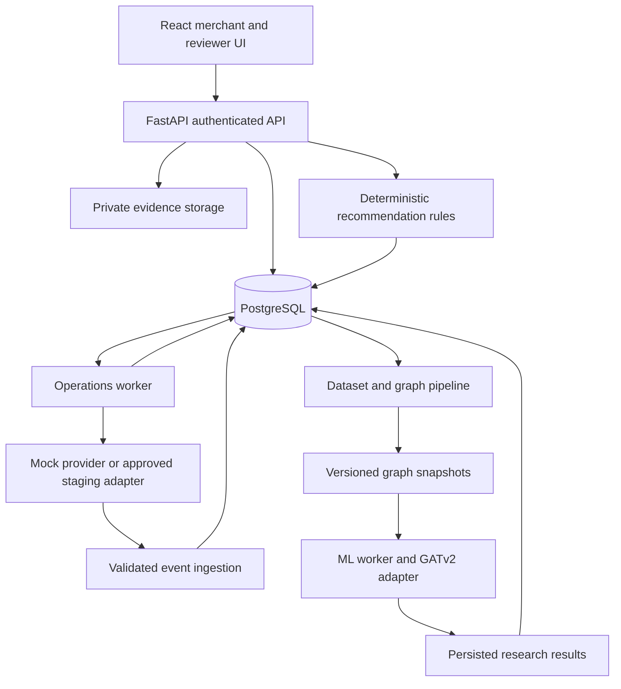

# Vyapaar Kavach prototype implementation plan for review

**Status:** Proposed scope awaiting your final verdict. No application code, dataset download, model training, deployment, or provider connection has started.

**Prepared:** 2 October 2026. **Context:** `TRISTACKOVERFLOW_VYAPAAR_KAVACH_BUILD_PLAN.md`. The attachment supplies context and proposed requirements; its instructions to begin implementation are not authorization to build.

This plan turns the original proposal into a buildable prototype with a persistent backend, merchant and reviewer interfaces, a replayable data pipeline, and a real ML inference path. It also identifies exactly what you must supply and what can be implemented without those inputs.

## 1 Review summary

The proposed deliverable is a merchant payment and refund investigation application. A merchant records a customer's claim, finds the relevant transaction, checks payment and refund observations, sees a supported next action, and exports an evidence summary. A reviewer can inspect relationships and run a separately evaluated GATv2 model.

| Decision | Proposed default |
| --- | --- |
| Prototype mode | Local application with synthetic data and a deterministic mock payment provider |
| Frontend | React, TypeScript, Vite, responsive merchant screens and desktop reviewer screens |
| Backend | FastAPI, Pydantic, SQLAlchemy, Alembic, PostgreSQL |
| Background processing | PostgreSQL job and outbox tables with Python workers |
| ML | Your existing GATv2 in an isolated reproduction environment; a separately versioned merchant experiment |
| Data engineering | Python ingestion and validation, PostgreSQL operational records, versioned Parquet research datasets |
| Model serving | Asynchronous jobs processed by an ML worker; persisted results polled by the UI |
| Payment integration | Working mock provider required; Paytm staging reads conditional on access |
| Refund actions | Working simulated refunds after concurrency and reconciliation tests; real funds outside this build |
| Default schedule | Ten working days with three contributors, subject to asset and hardware availability |
| Your immediate task | Review scope, supply model inventory and constraints, then give the build verdict |

**What “working” means:** The UI uses real API calls; records survive restarts; provider events are durably ingested; background jobs recover; exports use stored evidence; research scores come from an actual loaded model and recorded graph input. Simulated payments remain visibly simulated. A polished screen with hard-coded scores does not satisfy this scope.

There are two completion outcomes. The **core prototype** requires the workflow, backend, pipeline, mock provider, and tests. The **full AI prototype** additionally requires a runnable trained model, saved predictions, and a reproducible evaluation. If model assets are missing, the application can still be demonstrated, but the full AI milestone remains incomplete unless you explicitly accept a newly trained synthetic-model substitute.

## 2 Product experience and screens

### Merchant workflow

1. Sign in as a demo merchant owner or staff member.
2. Search by order or payment reference, or create an unmatched claim.
3. Record claim type, claimed amount, reference, and optional notes or invoice.
4. Review exact matches or select among candidates. Amount and time alone never establish identity.
5. Refresh provider status and see separate payment, refund, freshness, and conflict indicators.
6. Read a recommendation with the observations supporting it and any missing facts.
7. Check an existing refund, make a supported handoff, or authorize a simulated original-transaction refund when eligible.
8. Export the case and record a resolution. A handoff is not recorded as a completed refund.

### Required screens

| Screen | Required behavior |
| --- | --- |
| Login and merchant switch | Seeded accounts; server validates membership for every selected tenant |
| Merchant home | Search, open claims, unresolved refunds, freshness indicators |
| New claim and match | Structured claim entry, unmatched state, candidate comparison, explicit confirmation |
| Case detail | Payment/refund cards, next action, evidence timeline, notes, refresh and resolution controls |
| Refund confirmation | Owner-only simulated action; amount, original payment, existing obligations, immutable reference |
| Evidence preview | Source labels, redaction preview, Markdown/JSON download |
| Reviewer workspace | Assigned cases, local relationship graph, record drill-down, reviewer disposition |
| Research workspace | Dataset and model versions, inference jobs, scores or abstentions, baseline metrics, coverage |
| Demo controls | Synthetic scenarios, delayed events, provider outage, timeout and recovery; enabled only in demo mode |

Use text as well as colors for status. Merchant screens should work at a narrow mobile width. Graphs and experiment controls belong in the reviewer/research workspace. Every demo screen and export carries the synthetic/mock environment label.

### Three initial acceptance stories

| Story | Starting evidence | Expected result |
| --- | --- | --- |
| Delayed legitimate refund | Successful Rs 3,000 payment; existing Rs 500 refund pending | Track the existing refund and show its reference and verification time |
| Repeated request after timeout | Successful Rs 1,000 payment; Rs 1,000 refund submission outcome unknown | Keep reservation, reconcile the original reference, allow no replacement intent |
| Ambiguous payment claim | Two Rs 799 payments with no supplied reference | Present candidates or ask for reference; keep claim unmatched until confirmed |

Each fixture specifies exact records, timestamps, allowed actions, prohibited actions, and why the expected result is correct.

## 3 Architecture and deployment



Use one backend codebase with separate process entry points. The operations worker processes ingestion, reconciliation, and export jobs. The ML worker processes graph inference jobs in an independently pinned Python environment. A long model job must not occupy the payment reconciliation worker.

PostgreSQL stores application state and job metadata. Private files hold attachments, raw event payloads where needed, snapshots, and model artifacts. Research tables are exported to Parquet for reproducibility. There is no initial requirement for Kafka, Spark, Airflow, a graph database, Redis, Kubernetes, or a vector database.

For graph inspection, use SQL retrieval and a browser graph component such as Cytoscape.js. For bounded model inputs, use PyTorch Geometric. The selected stack and process layout are design proposals, not claims about software already installed.

### Local run target

After approval, provide a Compose configuration for database, API, web app, operations worker, and optional ML worker. Also document a native Windows development path if Docker is unavailable. Keep database and artifacts in persistent volumes or explicit local directories. Provide readiness checks, migrations, synthetic seed/reset commands, and separate test database configuration.

The normal startup command must not retrain models, fetch large datasets, reset the database, or contact production payment endpoints. Model training is an explicit offline operation. Synthetic reset is explicit and refuses to run against another environment.

Budgetary planning assumption: aim for a 16 GB RAM development laptop for the small synthetic demo, with CPU inference on bounded graphs. A GPU is optional for the core workflow and useful for model experiments. Exact memory and GPU needs for your model are unknown until inspection; full Elliptic2 processing is a separate workload. No cloud purchase is needed to start. Hosting and compute spend require a selected environment and budget later.

## 4 Backend modules and persistence

| Module | Responsibilities | Completion evidence |
| --- | --- | --- |
| Authentication and tenancy | Demo sessions, membership, role checks, scoped queries | Staff/owner/reviewer permissions verified through APIs |
| Payments | Order/payment lookup, multiple attempts, observations, current-state projections | Exact, missing, ambiguous and stale cases behave correctly |
| Claims | Case creation, matching, notes, attachments, versioned resolution | Complete case survives restart and retains change history |
| Provider adapter | Status reads, event verification, refund reconciliation, mock submission | Contract tests cover all documented mock outcomes |
| Policy engine | Match, freshness, conflict, existing-refund and eligibility rules | Every recommendation has reason codes and evidence IDs |
| Refunds | Reservations, idempotency, outbox, state machine, crash recovery | No over-reservation or duplicate submission in tested races |
| Evidence | Redacted exports and attachment provenance | Export facts trace to stored records |
| Data jobs | Imports, validation, replay, dataset materialization, snapshot building | Same input and version produce the same derived artifact |
| ML integration | Load model, validate inputs, run inference, persist manifests | Real output tied to checkpoint and snapshot hashes |
| Operations | Health, job queue, retry state, metrics and redacted logs | Provider/model failures are visible without false success |

### Database contract

All tenant-owned data carries `tenant_id` and `environment`. The server resolves access from the authenticated membership; it does not trust a browser-supplied tenant or role. Composite foreign keys and uniqueness rules prevent cross-tenant references.

| Tables | Essential fields and constraints |
| --- | --- |
| `tenants`, `users`, `memberships`, `sessions` | Provider account mapping; active role membership; expiring demo sessions |
| `orders`, `payments` | Unique scoped order reference; separate provider transaction IDs per attempt; integer paise; INR; normalized status |
| `provider_events`, `observations` | Raw payload reference/hash; verification result; source identity; event/observation/ingestion times; processing state |
| `cases`, `case_matches`, `case_notes` | Nullable payment link; match provenance; claim type; amount; actor; resolution and correction history |
| `refund_intents`, `refund_attempts`, `provider_refunds` | Immutable reference; scoped idempotency key and request hash; reservation; transport outcome; external-origin mapping |
| `attachments`, `exports`, `audit_entries` | Private storage key; content digest; source type; actor; redaction/export version |
| `jobs`, `outbox_jobs`, `import_runs` | Job type; attempt count; lease; next run; error category; input/output checksums |
| `dataset_versions`, `graph_snapshots`, `model_versions`, `model_runs` | Scope; cutoff; feature schema; artifact hashes; model/task compatibility; predictions and abstention |

Index tenant/environment with lookup references, case status, event time, and job due time. Use UTC internally, display Asia/Kolkata by default, and retain the provider's original representation in raw evidence. Validate money as decimal text at external boundaries and convert exactly to integer paise. Refuse negative amounts, fractional paise, and currency mismatches.

### Authentication and file handling

For the local demo, seed accounts with hashed passwords and expiring opaque sessions in HTTP-only cookies. Use CSRF protection for cookie-authenticated mutations and an explicit development origin allowlist. Deployment uses HTTPS and secure cookies. Research role access does not confer payment authority.

Allow only bounded PDF/JPEG/PNG evidence uploads initially. Store them outside the public web directory; download through an authorized route. Do not render uploaded HTML or execute file contents. Notes and filenames are escaped. A file digest detects later changes relative to the recorded digest; it does not authenticate the original document.

## 5 API and provider contracts

All following routes are proposed internal API routes, not Paytm endpoints. Return structured errors with a request ID, machine-readable code, human message, and retryability. Use `202` plus a job ID for asynchronous work, `409` for conflicting mutations, and `422` for invalid input. Inaccessible objects must not reveal their existence.

| Routes | Behavior |
| --- | --- |
| `POST /v1/auth/login`, `POST /v1/auth/logout`, `GET /v1/me` | Establish session and retrieve allowed memberships |
| `GET /v1/payments`, `GET /v1/payments/{id}` | Scoped search, cursor pagination, payment/refund detail |
| `POST /v1/payments/{id}/refresh` | Deduplicated, rate-limited status reconciliation job |
| `POST /v1/cases`, `GET /v1/cases/{id}` | Create/read matched or unmatched claims |
| `GET /v1/cases/{id}/match-candidates`, `POST /v1/cases/{id}/match` | Ranked candidates with reasons; explicit binding and correction history |
| `GET /v1/cases/{id}/timeline`, `GET /v1/cases/{id}/recommendation` | Provenance and deterministic next action |
| `POST /v1/cases/{id}/notes`, `POST /v1/cases/{id}/attachments` | Append notes and private evidence |
| `POST /v1/cases/{id}/exports`, `GET /v1/exports/{id}` | Generate and fetch a scoped Markdown/JSON evidence packet |
| `POST /v1/cases/{id}/resolve` | Record outcome and rationale; use a case version to reject stale edits |
| `POST /v1/refund-intents`, `GET /v1/refund-intents/{id}` | Owner-authorized mock refunds and tracked results |
| `POST /v1/provider-events/{provider}` | Authenticated provider-channel ingestion, separate from browser sessions |
| `POST /v1/imports`, `GET /v1/imports/{id}` | Scoped synthetic/authorized imports with validation report |
| `GET /v1/review/cases/{id}/graph` | Authorized local graph and underlying source references |
| `POST /v1/research/runs`, `GET /v1/research/runs/{id}` | Submit and inspect a real ML job |
| `GET /v1/jobs/{id}`, `GET /health/live`, `GET /health/ready` | Scoped job progress; minimal health information |

The recommendation response contains `action`, `reason_codes`, `supporting_observation_ids`, `missing_facts`, `provider_last_checked_at`, `policy_version`, and `execution_allowed`. Payment truth, match confidence, and model score use different fields.

### Provider interface

Each adapter implements capability discovery, event verification/parsing, payment status lookup, refund status lookup, refund-history reconciliation where supported, and original-payment refund submission where enabled. An unsupported capability returns an explicit result; it never returns a misleading empty history.

The mock provider maintains its own persisted payment/refund state and supports delayed notifications, duplicate deliveries, partial refunds, external-dashboard refunds, unknown responses, and accepted-then-timeout behavior. It remains separate from the app's local ledger so reconciliation tests can detect disagreement.

The official Paytm Transaction Status API is scoped to a merchant and order, with a signed request. That supports a merchant adapter proposal; it does not establish access for your account or every merchant product. [Transaction Status documentation](https://www.paytmpayments.com/docs/api/v3/transaction-status-api/)

The documented Refund Status request includes merchant, order, and refund reference fields. We will retain the original refund reference throughout reconciliation and verify the applicable response mapping for your enabled product. [Refund Status documentation](https://www.paytmpayments.com/docs/api/refund-status-api/)

Staging work requires an account capability sheet: enabled product, staging endpoint configuration, payment/refund read permissions, signature rules, webhook delivery, refund-history completeness, and supported statuses. All credentials remain server-side. Production writes stay disabled in this scope.

## 6 Payment and refund correctness

Payment state and refund state are separate. Payment statuses are `UNKNOWN`, `PENDING`, `SUCCEEDED`, `FAILED`, and `NO_RECORD`; observation verification is independently `UNVERIFIED`, `VERIFIED`, `STALE`, or `CONFLICTED`. Settlement and disputes remain separate optional facts.

Refund states are `DRAFT`, `RESERVED`, `SUBMITTING`, `PENDING`, `SUCCEEDED`, `SUBMISSION_UNKNOWN`, `FAILED_CONFIRMED`, `REVIEW_REQUIRED`, and `CANCELLED`. Cancellation is available only before an attempt. Unknown and review states retain their reservations.

### Submission transaction

1. Authorize owner, tenant, environment, provider capability, match, and fresh reconciled state.
2. Look up the scoped idempotency key. The same key and payload returns the existing intent; a changed payload returns conflict.
3. Lock the payment aggregate and recalculate obligations.
4. Atomically save the refund intent, reserve its amount, and enqueue the outbox job.
5. The worker atomically records submission ownership and a durable attempt before network I/O.
6. Submit using the persisted reference. On timeout, retain the reservation and reconcile that reference.
7. A replacement worker encountering an existing ambiguous attempt performs status reconciliation; lease expiry does not grant permission to submit again.

The local candidate balance is the verified successful payment amount minus successful refunds, distinct unresolved/reserved refund obligations, and applicable verified adjustments. Count a matched local intent/provider refund once. Transition from reserved to completed atomically. Include external refunds and stop execution on contradictory records or unknown obligations.

Example: a Rs 1,000 payment with Rs 600 already pending permits at most Rs 400 of additional local reservation before other restrictions. Two concurrent Rs 300 requests cannot both reserve successfully.

Local locks do not control another integration's actions. Mock tests simulate those races. Any future real execution additionally requires established provider-side eligibility controls and complete reconciliation; a positive local balance alone is insufficient.

No arbitrary destination field is accepted. A model cannot authorize, deny, or submit a refund. A delayed event cannot silently undo a verified success; conflicting observations trigger reconciliation while preserving the evidence.

## 7 Dataset strategy and acquisition

You do not need to obtain a public UPI fraud dataset before the core build. We will generate the exact payment, refund, claim, and event records required to test it. Public research datasets serve separate purposes.

| Dataset | Purpose | Who supplies it | Priority |
| --- | --- | --- | --- |
| Thirty reviewed workflow scenarios | Matching, recommendations, outages, refund correctness, exports | I implement fixtures; you review expected merchant actions | Required |
| Generated merchant research graphs | Train and evaluate a clearly labeled experimental case model | I implement generator, splits, baselines, and reports | Required for adapted synthetic ML route |
| Your exact Elliptic2 data/preprocessing sample | Reproduce your existing model on its original task | You provide existing files/paths and dataset version | Required for existing-engine reproduction |
| Full Elliptic2 source data | Rebuild preprocessing or reproduce full experiments if necessary | You obtain access if needed; avoid duplicate downloads | Conditional |
| Paytm staging records | Exercise a real provider read adapter | You provide account access/configuration and permitted samples | Optional |
| Redacted merchant payment/refund cases | Validate workflow assumptions and field mapping | You obtain permission and share minimal relevant records | Optional for demo; needed for real workflow evidence |
| PaySim | Optional independent synthetic transaction benchmark | Acquire only if we choose this additional experiment | Deferred |

Elliptic2 is a Bitcoin subgraph benchmark. The paper describes about 122,000 labeled subgraphs within a much larger background graph. It supports original-task reproduction, not merchant UPI performance claims. [Elliptic2 paper](https://arxiv.org/abs/2404.19109)

If you need the source again, use the dataset link in the [official Elliptic2 repository](https://github.com/MITIBMxGraph/Elliptic2). Its documented source files are `background_edges.csv`, `background_nodes.csv`, `connected_components.csv`, `edges.csv`, and `nodes.csv`. First check your existing preprocessed assets and record the applicable dataset terms; do not automatically download the full background graph for a small demo.

PaySim is a mobile-money simulator whose maintainer provides a sample-dataset link. It can support an additional simulation experiment but does not supply this application's complete claim/refund workflow or prove Paytm applicability. Adding it is optional and would require its own target and evaluation protocol. [PaySim maintainer repository](https://github.com/EdgarLopezPhD/PaySim)

### Proposed synthetic data sizes

Use two sizes: a smoke dataset for rapid tests and a research dataset starting around 100 merchants, 2,000 counterparties, 20,000 payment events, and 1,000 case episodes. These are engineering starting points, not estimates of market prevalence or sufficient statistical power. Scale after measuring memory and runtime.

Generate regular customers, shared suppliers, seasonal bursts, legitimate partial refunds, delayed events, duplicate claims, and simulated coordinated abuse. Keep latent scenario truth separate from observable records. Include normal activity resembling suspicious motifs, and vary class prevalence. Never include generator IDs, scenario names, future outcomes, or hidden truth in model inputs.

Thirty workflow cases should cover genuine returns, duplicate requests, ambiguous matches, missing references, external refunds, stale observations, invalid signatures, out-of-order events, timeout/restart races, missing identifiers, cross-tenant attempts, model outages, and graph lookalikes with legitimate explanations.

## 8 Data pipeline and quality controls

```text
Mock events / authorized imports / approved provider events
  -> capture raw input and provenance
  -> verify source and validate schema
  -> quarantine invalid or conflicting records
  -> normalize and deduplicate accepted events
  -> append observations and update scoped projections
  -> materialize versioned research tables at a decision cutoff
  -> construct observable graph snapshots and features
  -> run baselines and GATv2
  -> persist results, lineage, metrics, and abstentions
```

### Raw input

Store an input hash, source, environment, schema version, receipt time, and durable record pointer. Only the relevant adapter can classify an event as verified provider evidence. A merchant CSV or screenshot remains merchant-supplied information. A synthetic signed event remains synthetic.

For webhooks, validate the endpoint-specific signature and schema, durably record acceptance, then acknowledge. Rejected signatures never update financial state. Duplicate valid deliveries may be acknowledged without repeating their side effects. Unknown payloads go to a bounded quarantine with a reason and a controlled reprocessing path.

### Normalized records

Use at least these input contracts:

| Record | Core fields |
| --- | --- |
| Payment | Scoped order and transaction IDs; amount/currency; status; source event; event, observed and ingested times |
| Refund | Original transaction; reference; amount/currency; status; local/external origin; source event |
| Claim | Case/order reference where known; claim type; requested amount; created time; merchant statement |
| Relationship | Scoped pseudonymous endpoints; relationship type; source record; permission scope; observation time |
| Research label | Case episode; label value; label definition/version; adjudication source; label time; eligibility |

Missing values remain null with explicit missingness, not zero or invented identities. Stable entity linkage requires an authorized source key; names and equal amounts are insufficient. Pseudonymization is scoped so ordinary merchant datasets cannot be joined across tenants accidentally.

Deduplicate using provider event IDs when reliable, otherwise a documented fingerprint covering the logical event. A transaction ID alone is insufficient because its status can legitimately change. Preserve a later status as a distinct observation while ignoring repeated delivery of the same observation.

### Incremental processing and replay

Track import/run IDs, record counts, checksums, rejected rows, schema versions, job checkpoints, and projection versions. Retry recoverable ingestion and reads with bounded backoff. Exhausted jobs become failed/reviewable rather than retrying forever. Refund submission uses its special reconciliation rules, not generic job retry behavior.

An immutable observation log rebuilds projections into temporary tables; compare counts/totals before replacing the active projection. Replaying historical data must never reissue payment actions. Financial side-effect jobs are excluded from data replay. Test worker crashes both before and after committing progress.

For historical imports, use the time information was actually available if trustworthy. Otherwise the import time is its first known observation time. Do not backdate visibility merely because a transaction occurred earlier.

### Research materialization

Create `transactions.parquet`, `refunds.parquet`, `cases.parquet`, `relationships.parquet`, and a separate `labels.parquet`, plus a dataset manifest. Every graph snapshot records its source IDs, permission scope, decision cutoff, lookback window, feature version, sampling settings, and content hash.

Only events observed by the decision cutoff may enter the graph or aggregates. Fit scalers and encoders on training data only. Keep serving and training feature construction in the same versioned library and compare their outputs on a fixed test fixture.

Quality reports include accepted/quarantined counts, duplicate deliveries, unmatched references, identifier coverage, unknown statuses, late observations, and missing fields. An incomplete import must be visible to reviewers and must not imply complete refund history.

## 9 GATv2 integration and ML experiments

### What you need to hand over

Provide the existing repository or ZIP and the following artifacts, where available:

```text
model_handoff/
  model.py or source package       # architecture and customized GATv2 layers
  checkpoint.pt                   # trained weights with their source/version
  config.yaml                     # dimensions, heads, layers, pooling, dropout
  preprocess.py                   # exact feature and graph construction
  feature_schema.json             # ordered names, units, types, missingness rules
  scaler_or_encoder_artifacts/    # fitted preprocessing assets
  requirements.txt or lockfile    # Python, PyTorch, PyG and CUDA compatibility
  inference_example.py            # one working input-to-output invocation
  sample_input/                   # small permitted processed graph sample
  expected_output.json           # output from your current implementation
  split_manifest.json            # exact train/validation/test membership
  evaluation_report.json         # metric definitions, threshold and results
  README.md                       # original dataset/version, commands and notes
```

These are requested handoff names, not existing files. If your project organizes them differently, share its current layout. Do not rewrite it just to match this tree. A `.pt` file alone usually does not establish the architecture, feature order, or preprocessing required to load it correctly.

Your reported F1 around 0.60 remains unverified until reproduced. Record its task, positive class, averaging, threshold, class counts, and test split. F1 is not accuracy.

### Integration sequence

1. Inventory and hash your code, checkpoint, preprocessing, dependencies, and sample data.
2. Recreate its compatible environment without upgrading or refactoring the model first.
3. Run the supplied sample and compare output against your expected result with a documented numeric tolerance.
4. Reproduce the reported evaluation if its exact data/splits are available. If only sample inference works, say so separately.
5. Wrap the original engine behind a versioned adapter and expose original-domain results in the research workspace.
6. Define a separate merchant research graph and target. Decide whether compatible weight reuse is technically defensible.
7. Train a merchant model from scratch as the required comparison; test transferred weights only where feature semantics and architecture support it.
8. Save predictions, manifests and baseline metrics, then integrate actual inference into the prototype.

Identical input dimensions do not establish matching feature meaning. If the original model consumes node labels or topology different from the new case task, it cannot be relabeled as a merchant classifier. Architecture reuse and checkpoint transfer are separate decisions.

### Proposed merchant task

Predict `simulated_abuse_episode` for a case-centered graph at its decision cutoff. This is a research target about a generated episode, not a judgment that the merchant or payer committed fraud. A real-data version requires independently adjudicated labels and a new validation study.

Keep the operational evidence graph separate from the experimental transaction graph. The operational graph links cases, orders, payments, refunds and evidence for navigation. The experimental graph uses observable pseudonymous merchant/counterparty nodes, directed payment/refund relationships, and focal-case indicators.

If there is no authorized stable counterparty identifier, omit the relationship and record missing coverage. Never create synthetic identity matches inside real merchant data. Cross-merchant edges are confined to a labeled synthetic research workspace or an explicitly approved research scope.

### Feature and tensor contract

Candidate node features include type, historical counts/amounts, counterparty concentration, recent activity, and focal-entity indicators. Edge features include log amount, event age, relationship type, direction and available channel fields. Use missingness and coverage indicators to support abstention, and audit whether they become shortcuts for the label.

For a bounded graph, the adapter accepts `x[N,F]`, `edge_index[2,E]`, optional `edge_attr[E,D]`, batching assignments, focal-node masks, and non-feature metadata. The manifest fixes ordered feature names, dimensions, edge direction, self-loop policy, scaling, lookback, and sampling rules. Labels are never included in a serving request.

Start experiments with a two-hop neighborhood, a 30-day lookback, and caps such as 256 nodes and 2,048 edges per case. These are tunable proposals. Record truncation and test larger/smaller caps; a truncated graph must not masquerade as complete visibility.

Proposed initial model: feature encoders, two GATv2 layers, focal-entity representation plus pooled graph representation, and a binary classification head. Start with 64 hidden channels, four heads, and dropout 0.2. Set concatenation deliberately and document the resulting dimensions. PyG supports optional edge features through `edge_dim`; implementation must match the pinned version and your architecture. [GATv2Conv documentation](https://pytorch-geometric.readthedocs.io/en/latest/generated/torch_geometric.nn.conv.GATv2Conv.html)

### Experiments and evaluation

| Experiment | Purpose |
| --- | --- |
| Deterministic review-priority rules | Same research target and case set as learned models |
| Rules plus simple relationship statistics | Measure what ordinary graph queries already solve |
| Logistic regression and a small boosted-tree baseline | Test whether aggregate features explain the signal |
| GATv2 trained from scratch | Establish graph learning performance on the proposed task |
| Compatible initialization from your checkpoint | Test transfer benefit if feasible |
| Topology removal/shuffling and restricted visibility | Test whether graph structure helps and whether results survive realistic missing data |

Use a small comparable tuning budget. Keep synthetic worlds/episodes grouped so related episodes do not appear in multiple splits. Freeze a 60/20/20 train/validation/test allocation for independent worlds as a starting protocol. Separately report a chronological within-world evaluation with historical visibility cutoffs, and a held-out mechanism stress test. These answer different questions; do not blend their scores.

Choose operating thresholds using validation data. Freeze the final test set before training decisions. Evaluate three random seeds if compute permits; report fewer runs explicitly. The 1,000-episode starting dataset may leave too few positives for stable conclusions, so report counts and uncertainty rather than calling a small numerical gain a pass.

Report positive-class precision, recall, F1, PR-AUC, confusion matrix, precision/recall at a fixed review budget, abstention coverage, and inference latency. Include false-positive referrals at comparable recall. Baselines get the same observable information and case eligibility. Do not convert an uncalibrated score into a probability.

The proposed continuation target is at least 10% relative reduction in false-positive review referrals at comparable recall against the strongest simple baseline, with no collapse under restricted visibility. Agree on the operating recall, uncertainty treatment, and minimum useful sample before opening the test set. This is a target, not a promised result. A synthetic improvement permits further research only.

### Serving contract and failure behavior

`POST /v1/research/runs` validates the caller's scope, dataset, graph schema, model compatibility, and cutoff, then enqueues a job. The ML worker loads a trusted registered checkpoint, calls evaluation/inference mode, and stores the output before marking the job complete. The UI polls for completion and can continue displaying payment facts while it waits.

Persist `model_version`, `checkpoint_hash`, `graph_snapshot_id`, `task`, `data_mode`, `feature_schema_version`, `experimental_score`, `abstained`, `abstention_reason`, runtime, and supporting source references. Cache only within the same authorized scope and environment, keyed by snapshot hash, model hash, and inference configuration.

Abstain for unavailable models, incompatible schemas, invalid numeric inputs, inadequate coverage, unsupported graph/task types, or resource limits. Never fill a missing score with zero, randomness, or a fixture value labeled as inference. Recorded original-domain predictions are identified as recorded research artifacts, with no claim that they score the current merchant case.

Attention weights may help inspect a model but are not proof of causation or misconduct. Relationship evidence is displayed with source records; perturbation experiments are labeled as model sensitivity analysis.

### Optional language features

Use structured forms and deterministic explanations in the required build. An optional later language model can extract a proposed claim type/reference/amount from text or draft a merchant-reviewed explanation. Such extraction requires confirmation and cannot establish payment truth. OCR, voice, Hindi translation, chat interfaces, and automatic messaging are outside the default scope and must not delay working GATv2/data integration.

## 10 Your work and the implementation work

| When | What you need to do | What to provide | What depends on it |
| --- | --- | --- | --- |
| Before the build verdict | Confirm deadline, available contributors, preferred demo format and machine/GPU limits | Short written constraints | Final scope and schedule |
| Before existing-model integration | Share your model project and current inference command | Repository/ZIP or local path plus handoff inventory above | Loading your customized model |
| Before reproducing F1 | Identify exact dataset/version, preprocessing and split | Existing data paths, split IDs and metrics | Verified original-model performance claim |
| Before obtaining more data | Check what assets you already have and their permitted use | Inventory and access/source links | Avoiding unnecessary downloads |
| During the first build milestone | Review three case stories and approve expected next actions | Corrections to fixture outcomes | Product behavior and demo narrative |
| Before any Paytm staging work | Obtain the appropriate test account and confirm enabled product | Staging configuration and secure local credential setup | Real provider read integration |
| During product validation | Speak with target merchants and collect consented, redacted examples if available | Workflow notes and minimal records | Evidence of demand and workflow usefulness |
| Before any hosted demo | Choose local-only or hosted scope and a spend limit | Deployment target and account access if applicable | Hosting implementation |
| Final rehearsal | Run the demo as a user and approve the description of results | Feedback and final scope acceptance | Submission readiness |

Do not paste payment keys, banking secrets, or raw personal customer records into the plan. The eventual setup instructions will identify local environment variables or a secrets store. No provider credentials are needed for the synthetic demo.

**Implementation work I can handle after approval:** scaffold the approved project; build schemas, APIs, interfaces and workers; implement synthetic fixtures and generator; write adapters and the ML wrapper; run available model experiments; implement meaningful tests; fix integration failures; prepare reproducible setup instructions, evaluation reports and a demo script. Account enrollment, permission to use external data, merchant interviews and access to your existing model assets remain your inputs.

### Minimal handoff checklist

- [ ] Build deadline and actual team availability.
- [ ] Laptop RAM/OS and GPU model/VRAM, if any.
- [ ] Existing model code location and checkpoint location, or confirmation they will arrive later.
- [ ] Original dataset identity and existing processed sample.
- [ ] Current inference/training command and dependency file.
- [ ] Choice to include Paytm staging only if credentials are available.
- [ ] Local demo accepted as the default delivery target.
- [ ] Final verdict authorizing implementation.

Missing model assets do not block the backend start after approval. They do block the claim that your customized model has been integrated. Missing sandbox access does not block a working mock integration.

## 11 Build sequence and responsibility

The schedule below assumes three contributors and ready access to the model by day 3. It is a planning estimate, not a deadline guarantee. With one contributor, preserve the dependency order and either extend the schedule or explicitly reduce scope. Full original-dataset reproduction may exceed this schedule.

| Day | Backend and pipeline track | Frontend and product track | ML and verification track | Exit condition |
| --- | --- | --- | --- | --- |
| 1 | Schemas, migrations, roles, mock provider, seed pipeline | Case/navigation skeleton and source labels | Model inventory, fixture/feature contracts | Shared contracts and three case fixtures agreed |
| 2 | Search, matching, refresh, timeline and export | End-to-end merchant flow | Tenant isolation and workflow tests | Read-only slice passes without model/network |
| 3 | Idempotent ingestion, jobs, refund reservation/outbox | Simulated refund confirmation | Original model sample inference/environment audit | Durable worker and model status report |
| 4 | Timeout/restart handling, external-refund fixtures | Reviewer timeline and local graph | Generator, validation reports, snapshot builder | Refund invariants and pipeline replay pass |
| 5 | Dataset versioning and ML job API | Research job/results screens | Split freeze, rules/tabular/graph-feature baselines | Reproducible dataset and baseline outputs |
| 6 | ML worker integration, error handling | Coverage, provenance and abstention display | Train adapted GATv2; expand to 30 scenarios | Actual model inference visible in research view |
| 7 | Conditional staging reads, otherwise reliability fixes | Merchant task-study sessions if available | Baseline comparisons and ablations | Recorded comparison and contract test results |
| 8 | Access, files, replay and performance checks | Fix user confusion and accessibility issues | Final held-out evaluation and model decision | Model contribution reported honestly |
| 9 | Freeze required scope; clean-install fixes | Demo script and export polish | Reproduction manifest and claims review | No critical correctness defects |
| 10 | Clean start, restart and recovery rehearsal | Final walkthrough | Final metrics and limitations report | Core/full-AI completion status documented |

The critical path is contracts → persistent backend → read-only workflow → refund correctness → reliable pipeline → integrated inference → rehearsal. Staging, optional language features, and visual polish are not allowed to displace core correctness. Team role suggestions do not authorize automated delegation or outreach.

### Planned project structure

```text
apps/web/                       # React application
services/api/app/               # routes, domain logic, persistence, provider adapters
services/api/tests/             # domain and API integration tests
services/worker/                # operations and reconciliation entry point
services/ml_worker/             # isolated inference entry point
pipelines/                     # ingest, validate, materialize, build snapshots
ml/original_engine/             # preserved reference/import of your supplied project
ml/adapters/                    # versioned serving adapters
ml/baselines/                   # same-task comparison models
ml/training/                    # adapted-model training and evaluation
fixtures/workflows/             # reviewed merchant cases
fixtures/provider/              # provider responses and fault scenarios
configs/                       # non-secret environment and experiment configuration
artifacts/                     # local datasets, snapshots, models, predictions; ignored as needed
docs/                          # setup, contracts, model/data cards, demo and test reports
compose.yaml
.env.example
```

These paths are proposed. Runtime compatibility may require separate dependency locks for the API and original model. Large/private data and checkpoints are not committed to ordinary source control by default; manifests record their expected hashes and acquisition paths.

## 12 Tests and acceptance gates

Implement tests around behavior, financial invariants and observable workflows. Unit tests alone do not establish a working prototype.

| Area | Required verification |
| --- | --- |
| Matching | Exact match, missing reference, same amount/time collisions, explicit match correction |
| State | Duplicate and late events, unknown codes, conflicting observations, stale reads |
| Access | Cross-tenant list/detail/export/file/graph/job access denied; staff cannot authorize refunds |
| Refunds | Repeated click, same key/different payload, concurrent partial amounts, external refunds, timeout, worker crash and expired lease |
| Pipeline | Invalid source/schema quarantine, re-import idempotency, projection replay, late visibility, no side effects during replay |
| ML | Checkpoint/sample compatibility, feature parity, cutoff leakage, split contamination, unsupported schema, missing model and CPU resource limit |
| UI | Three core cases through real backend, reload persistence, outage recovery, source labels and exports |
| Evidence | Redaction, all claims linked to sources, unresolved facts preserved, tampered/updated attachment retains version history |
| Recovery | Restart database/workers/app with in-flight jobs; no lost reservation or invented completion |

Run integration tests against PostgreSQL so transaction/locking behavior matches the prototype. Use property-based interleavings for refund obligations, including duplicate events and process restarts. Browser tests verify critical user journeys rather than every visual element.

### Proposed performance targets

Measure on declared hardware and data size: case page p95 below 2 seconds; local policy calculation p95 below 200 ms; small export below 5 seconds; bounded CPU model inference target below 2 seconds or asynchronous completion with visible progress. External provider waiting time is measured separately. These are engineering targets, not observed results or provider SLAs.

### Gates

1. **Core workflow gate:** three initial cases complete through persistent API/UI, including refresh, recommendation and export.
2. **Mock execution gate:** authorization, reservations, concurrency, timeout and recovery tests pass before refund controls are enabled.
3. **Pipeline gate:** imports validate, deduplicate and replay; research artifacts have lineage; cutoff and split checks pass.
4. **Model integration gate:** real inference succeeds and persists versioned inputs/outputs; no hard-coded score fallback.
5. **Model usefulness gate:** comparison against the strongest simple baseline is reported. A failed or inconclusive result keeps the GNN in research mode.
6. **Staging gate:** account-specific capabilities and contract tests pass; otherwise deliver mock-only provider integration.
7. **Delivery gate:** clean setup, restart recovery, test report, demo script and honest completion matrix.

A model can pass the integration gate and fail the usefulness gate. The result is still real working ML, but does not justify a claim that GATv2 improves merchant decisions.

## 13 Demonstration and final artifacts

The five-minute demonstration starts with the pending-refund case, shows an ambiguous unmatched claim and a legitimate refund path, injects an accepted-then-timeout mock response, then shows recovery without a second refund. The research scene runs an actual model on a labeled synthetic graph and displays its baseline comparison. Finish by exporting the case evidence.

If the GNN does not improve the baseline, show that result and the direct relationship view. If it cannot run, state that the full AI milestone is incomplete; a graph animation does not substitute for inference.

Deliverables after the approved build:

- Working source, environment examples, dependency locks and database migrations.
- Reproducible local startup and synthetic seed/reset instructions.
- OpenAPI contracts and provider capability documentation.
- Thirty reviewed workflow scenarios and the synthetic research generator.
- Versioned datasets, feature/graph manifests and split definitions.
- Existing-engine reproduction report, even if it documents a specific blocker.
- Adapted model artifact where trained, baseline reports, predictions and ablation results.
- Automated test results, performance measurements and known limitations.
- Merchant/reviewer walkthrough, demo script and export examples.

For workflow validation, aim for exploratory merchant interviews followed by a small counterbalanced task study if participants are available. Compare the app with a transaction-list/checklist workflow using equal underlying information. Report completion, harmful errors, active handling time and sample counts. Do not attribute interface gains to the GNN or claim prevented losses from flagged amounts.

## 14 Decisions for your final verdict

Review these choices before authorizing implementation:

| Decision | Recommendation | Consequence of a different choice |
| --- | --- | --- |
| Required demo | Persistent merchant workflow plus actual synthetic research inference | Requiring production integration introduces access and operational dependencies |
| Existing GATv2 | Preserve and reproduce it, then assess adaptation | Directly reusing its scores for merchant cases would not be a validated transfer |
| Required data | Generated workflow/research data plus your existing-model sample | Requiring real labels delays the ML task until data access is established |
| Provider | Mock required; staging reads conditional | Mandatory staging changes the schedule if account access is unavailable |
| Execution | Simulated refunds only | Real funds require a separate future scope and review |
| Optional features | Defer OCR, voice, chatbot, Kafka and graph database | Adding them increases integration time without completing the core flow |
| Model gate | Report negative/inconclusive results and retain research labeling | A guaranteed accuracy or improvement claim cannot be promised in advance |

You can give the final verdict as: **“Approve the plan and start building with these changes: …”** Include any changed deadline, scope or model/data location. Until that verdict, this document is a review artifact only.
